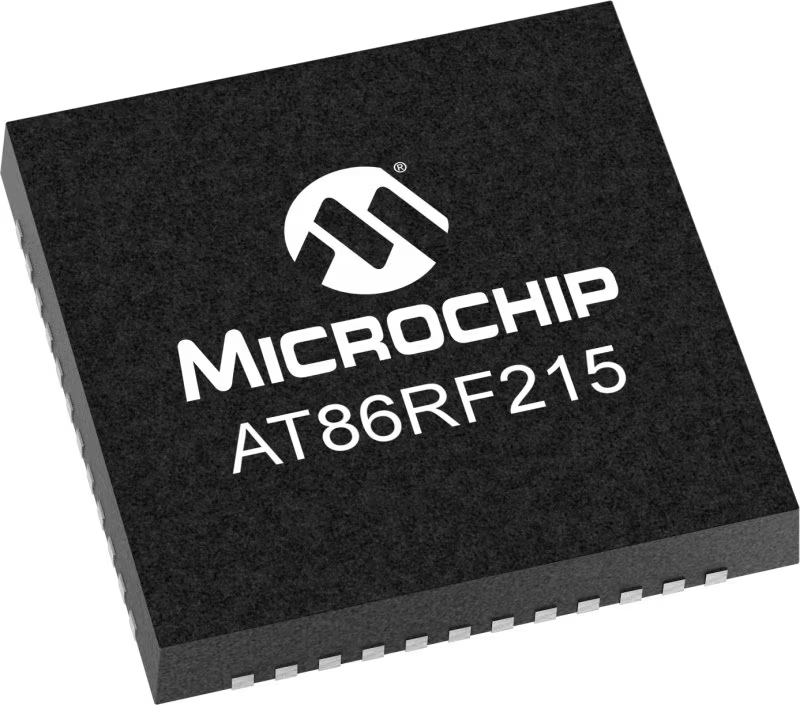

# AT86 Gateway

The AT86 is a radio module that serves as the primary communication link between drones and the [Maestro Server](https://wiki.droneshow.software/wiki/Maestro\_Server). The Atmel AT86RF215 radio provides all functionality necessary to support the [IEEE 802.15.4](https://wiki.droneshow.software/wiki/IEEE\_802.15.4) standard that the [Verge Aero network framework](https://wiki.droneshow.software/index.php?title=Nixie\&action=edit\&redlink=1) is built upon. It contains tranceivers for two bands, one 2.4 GHz band, and one Sub-GHz band.

<figure><figcaption>
An Atmel AT86RF215 chip
</figcaption></figure>

The [X1](../drones/x1.md) and [X7](../drones/x7.md) integrate an AT86 radio to support any point-to-point read or write operations. It is configured to provide a good balance between high-reliability and high-bandwidth.

### What It Is Used For

The AT86 is the primary data link and provides an up and downlink. It is used for:

* [Telemetry](https://wiki.droneshow.software/index.php?title=Telemetry\&action=edit\&redlink=1)
* Individual Drone Commands
  * Setting safeties
  * Setting individual [light modes](https://wiki.droneshow.software/index.php?title=Light\_modes\&action=edit\&redlink=1)
  * [Calibration](https://wiki.droneshow.software/index.php?title=Calibration\&action=edit\&redlink=1)
  * [Motor Tests](https://wiki.droneshow.software/index.php?title=Motor\_Tests\&action=edit\&redlink=1)
  * Etc.
* [Uploading show files](https://wiki.droneshow.software/index.php?title=UFTP\&action=edit\&redlink=1)
* [Updating drone firmware](../../drone-show-software/verge-console/firmware-vpkg-system.md)

#### Dual-Band Operation

Both bands can be used simultaneously, but only one is used in the current software package. Support for dual-band operation is intended to be added in the latter half of 2024.
