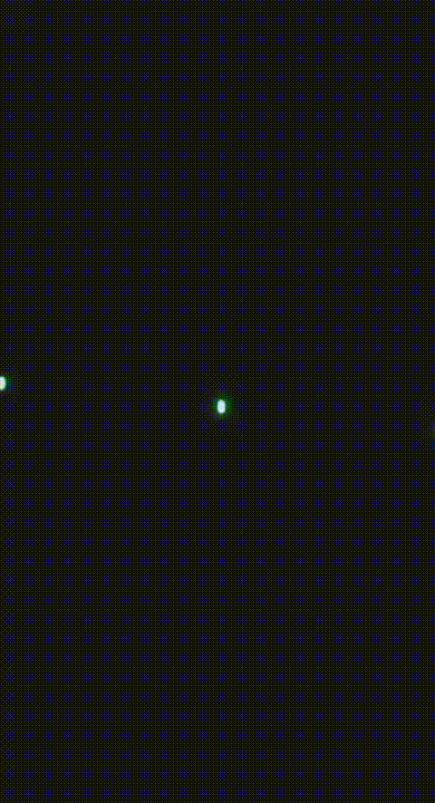

# Mines

| Name                   | Effect                                                                                                                                          | Timestamp |
| ---------------------- | ----------------------------------------------------------------------------------------------------------------------------------------------- | --------- |
| Purple/Green Mine Up   | 

<figure><figcaption></figcaption></figure>
 | 3::12::00 |
| Gold Mine Down         | 

<figure><figcaption></figcaption></figure>
   | 3::31::00 |
| Glitter Mine Down      | 
<figure><figcaption></figcaption></figure>
                | 3::41::00 |
| Glitter Mine Short Up  | 
<figure><figcaption></figcaption></figure>
       | 3::51::00 |
| Gold Mine Up           | 
<figure><figcaption></figcaption></figure>
                | 3::52::00 |
| Gold Glitter Mine Down | 
<figure><figcaption></figcaption></figure>
       | 8::00::00 |
