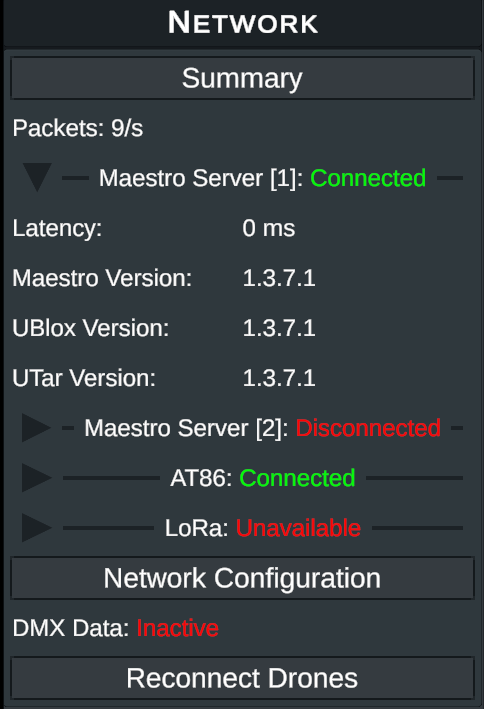
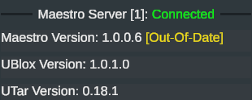

# Maestro Server

The Maestro Server is a core component in the Verge Aero base station. It is responsible for hosting and managing network connections with all devices on the local network. The [Verge Aero Console](verge-console/) also connects with the Maestro Server in order to translate commands into wireless signals via the [AT86](../drone-show-hardware/networking/at86-gateway.md)/[LoRa](../drone-show-hardware/networking/lora-gateway.md) gateways. Additionally, the server contains USB drivers to support a directly-connected u-blox ground station RTK module. [RTCM](../drone-show-technology/gps-gnss/rtcm.md) data is gathered and transmitted through the Maestro Server with no need for a [Verge Aero Console](verge-console/) to be connected. This ensures that, should a connected laptop get disconnected or damaged, mission-critical data streams are left uninterrupted.

### Updating the Maestro Server

<figure><figcaption>
Shows Maestro Server versions
</figcaption></figure>

<figure><figcaption>
Shows Maestro Server Out-Of-Date
</figcaption></figure>

The Maestro Server can be updated via the [Verge Aero Console](verge-console/). The console reads the current version of all applications running on the Maestro Server computer and displays them in the network summary panel. If the version differs from the version available in a loaded [VPKG](verge-console/firmware-vpkg-system.md), then it will display an "Out-Of-Date" message. Performing a standard system update will synchronize all modules running on the server with the version in the loaded [VPKG](verge-console/firmware-vpkg-system.md).
