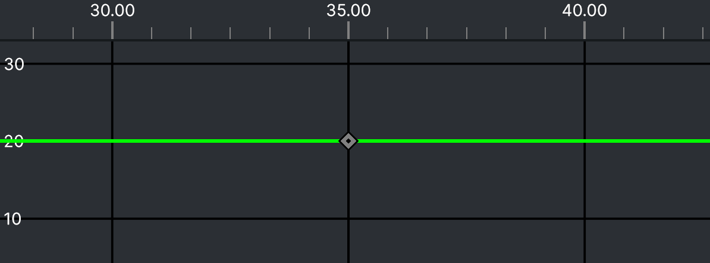
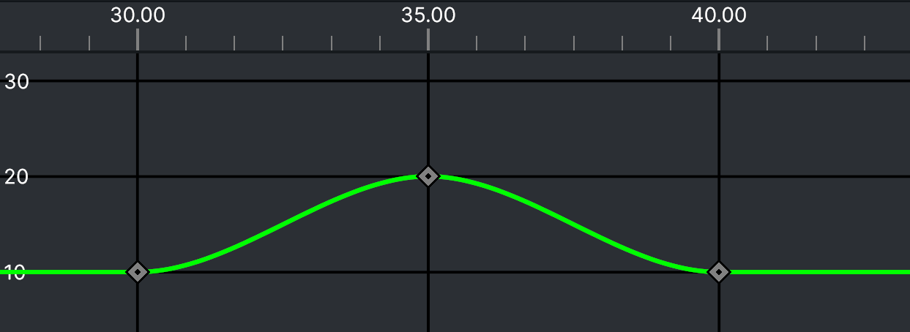
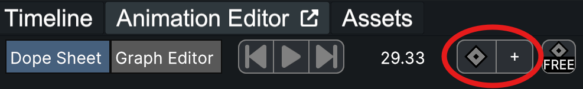
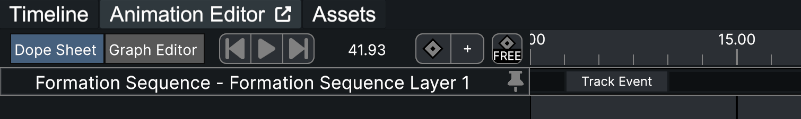
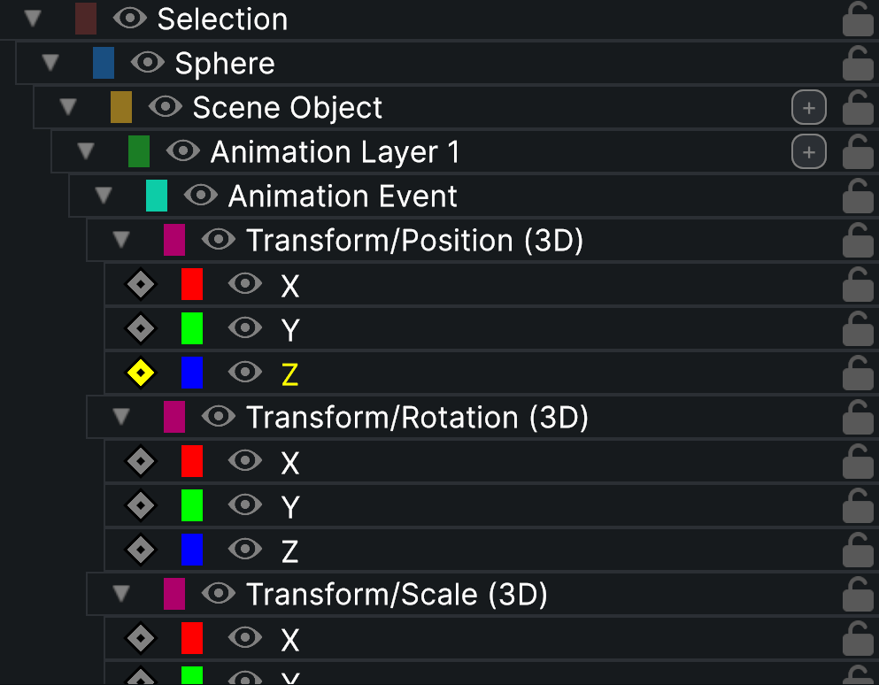
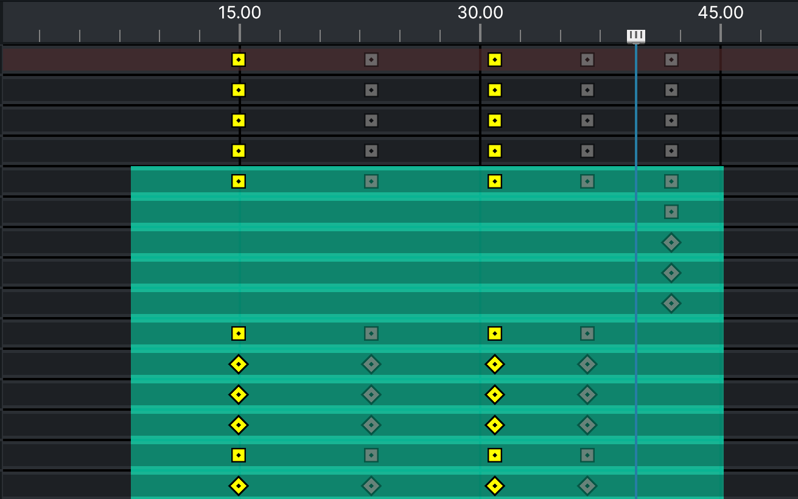
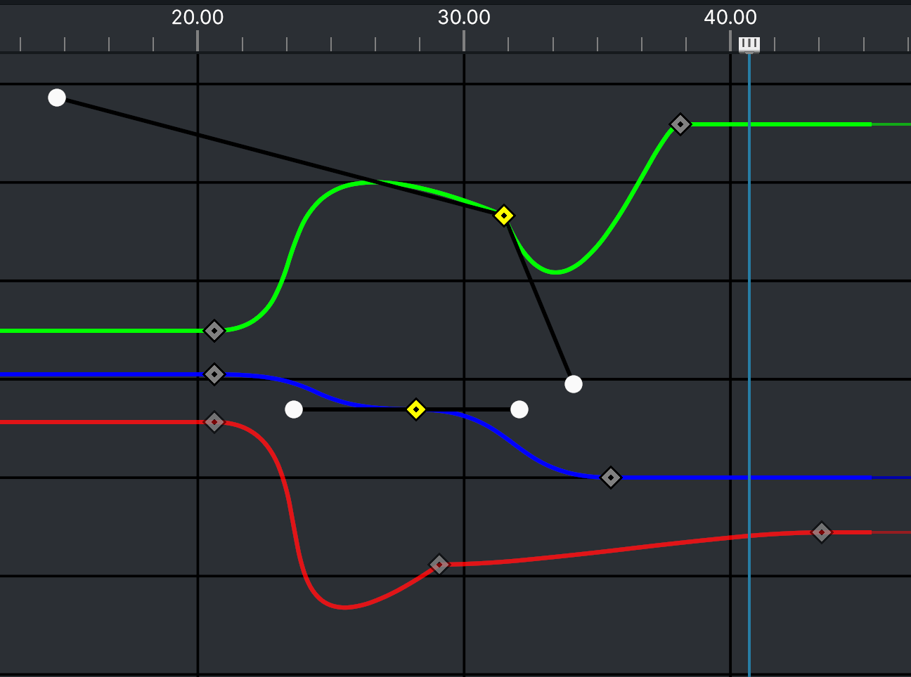

# Animation Editor

The Animation Editor is a tool within the [Verge Design Studio](./) that simplifies the manipulation an object's properties over an interval of time. Like other 3D animation tools, it is driven by the use of keyframes, which can be created and modified in its Dope Sheet and the Graph Editor views.

### Getting Started

#### How to Access It

The Animation Editor can be found by navigating to the Animation Editor tab above the timeline. Then, select the objects to animate from the object hierarchy.

#### When to Use It

The Animation Editor is best suited for any objects that will exhibit movement (ex. translation, rotation, orbit, growth, etc) over a period of time. It is not effective for creating static shapes.

#### Core Concepts

<figure><figcaption>
An example of a property with a static value of 20
</figcaption></figure>

Objects are made up of many different properties, some examples being position, scale, and radius. Depending on the type or configuration of an object, an object's available properties may vary. These properties define how the object exists in space.

Assuming no other manipulation is present, setting these property values in the Inspector will preserve those values for the entirety of a design. Take an object's position, for example. If the position is set to a height value of 20, then the object will remain at a height of 20 always.

<figure><figcaption>
An example of a property animating from a value of 10, to 20, back to 10
</figcaption></figure>

If, instead, the intention is for the object to rise to the height of 20 and come back down over the course of 10 seconds, we can use the Animation Editor. The images to the right are visualizations of these two cases, with the green line representing the property that controls the object's height. The line shows the value of the property at any given point in time. The gray diamonds (keyframes) set a property's value at a distinct point in time.

At its core, the Animation Editor is a means to add keyframes to properties. These keyframes can be used to manipulate the property curve to change over the course of the design.

The Animation Editor makes use of the [Choreography Timeline](https://wiki.droneshow.software/index.php?title=Choreography\_Timeline\&action=edit\&redlink=1) system to manipulate the root object. The relationship from root object to keyframe is as follows:

* Root Object
  * Component
    * Animation Layer
      * Animation Event
        * Property
          * Keyframe

The Dope Sheet and Graph Editor are two distinct views of the same keyframe information. Generally, the Dope Sheet is better suited for modifying timing, while the Graph Editor is best suited for modifying property values and keyframe interpolations.

### Keyframes

Keyframes define the value of a property at a given time, as well as the interpolation of the value between itself and its neighboring keyframes (see Graph Editor). They drive the entirety of the animation system, and any modification of an animation requires a modification of one or more keyframes.

Both of the Animation Editor's views contain right click options to create keyframes, but they can be created separately as well.

<figure><figcaption>
Circled: Auto Keyframe Mode Toggle (left), Add Keyframe (right)
</figcaption></figure>

#### Auto Keyframing

Auto Keyframe mode will automatically create and modify existing keyframes when properties are set at any given time.

For example, assume a design contains an object with no keyframes on it yet, with Auto Keyframe mode enabled. Setting the design time to 35 seconds and modifying the object's position Y value to 20 will create a new keyframe at that time and value. Then, setting the design time to 40 and value to 25 will also create a matching keyframe.

#### Manual Keyframing

Manual Keyframe behaves similarly to Auto Keyframe mode, but will create new keyframes for all properties, regardless of whether or not they've changed. Some properties keyframes may not be added if the property curve does not already exist AND the property value is the default value.

With the Animation Editor open, a keyframe can be manually added by pressing the 'T' key or pressing the 'Add Keyframe' button.

#### Keyframe Relationship

The Keyframe Relationship button determines how a keyframe should be affected when its parent animation event's start or end times are modified. The three modes are:

* Free - keyframe remains at the same design time (i.e. keyframe at 30 seconds design time will stay at 30 seconds)
* Relative - keyframe maintains same time proportion within the event (i.e. will stay at 75% of the time of the event)
* Absolute - keyframe maintains timing relative to the beginning of the event (i.e. will stay at 1 second after start of event)

<figure><figcaption>
Keyframes will appear on animation events on the main timeline
</figcaption></figure>

#### Outside of the Animation Editor

Keyframes on animation events are visible on the main Timeline. Keyframes times can be modified from here by first selecting the animation event, and then dragging the keyframes.

### Formation Sequence Selections

<figure><figcaption>
A Formation Sequence pinned to the Animation Editor
</figcaption></figure>

Selected objects will be displayed in the Animation Editor, where animations can be created or modified. Two special exceptions to this are Launch Pads and Formation Sequences. Instead, these two types will display their timeline events at the top of the Animation Editor. This makes it easier to line up animations with these events without having to leave the Animation Editor. These can be pinned in the hierarchy so that they remain there if if the object is deselected.

### Hierarchy

<figure><figcaption>
The Animation Editor Hierarchy
</figcaption></figure>

The hierarchy displays the selected root objects and all relevant components down to the animated properties.

Layers, events, and properties can be added with the '+' button.

Lock elements using the lock icon. Locked elements will restrict the modification of that element (or it's children's) keyframes.

Toggle a property's visibility using the eye icon. Visibility is only affected in the Graph Editor.

Collapsing irrelevant elements in the hierarchy can make it easier to navigate the Animation Editor when dealing with a large number of properties.

### Dope Sheet

<figure><figcaption>
An example of the dope sheet with several properties
</figcaption></figure>

The Dope Sheet is a high-level view of animations. Its primary purpose is to set timing for keyframes and to coordinate timing across different properties or objects. It does not provide any way to modify the interpolation between keyframes, which is instead handled by the Graph Editor.

Diamond keyframes in the Dope Sheet represent property keyframes. These are the 'true' keyframes used to calculate animations. Square keyframes are created at all higher levels in the hierarchy for any given property keyframe. They exist solely to to group and organize property keyframes. Dragging a 'higher level' square keyframe will drag child elements that have keyframes at the same time.

To create a keyframe, right click on a property's lane at the desired time of the keyframe.

The blue rectangle behind the keyframes represents an animation event. Drag the left or right edges of the rectangle to modify the start or end times of the event, or drag from the center of the event to move it as a whole. Note that keyframes will respond differently to these changes based on the currently set Keyframe Relationship.

### Graph Editor

<figure><figcaption>
Three properties being modified in the graph editor, with two keyframes selected
</figcaption></figure>

The Graph Editor view displays curves for all properties and is where the interpolation between keyframes can be modified. While keyframe times can be modified in the Graph Editor, the Dope Sheet is typically better suited for it.

The lines in the graph editor represent the value of a property at any given point in time. Keyframes can be dragged left and right to modify their times, and up and down to modify their values.

When selecting a keyframe, if it has neighboring keyframes on the same property, it will display its interpolation handles. Drag these handles to modify the interpolation between the keyframe and its neighbors.

To add a keyframe, select a property in the hierarchy and right click in the Graph Editor, then choose "Add Keyframe". This will create a keyframe at the play head.

It is recommended to make use of the visibility toggle in the hierarchy to hide/show properties as needed.

### Basic Controls and Usage

_Multiselect/highlight (Dope Sheet and Graph Editor)_ - click + drag

_Add keyframe shortcut_ - 'T'

_Add keyframe via right click_ - see Dope Sheet and Graph Editor sections

_Cut_ - 'Ctrl/Cmd' + X

_Copy_ - 'Ctrl/Cmd' + C

_Paste_ - 'Ctrl/Cmd' + V

_Delete Keyframe_ - Windows: 'Del' OSX: 'Cmd' + 'Del'
