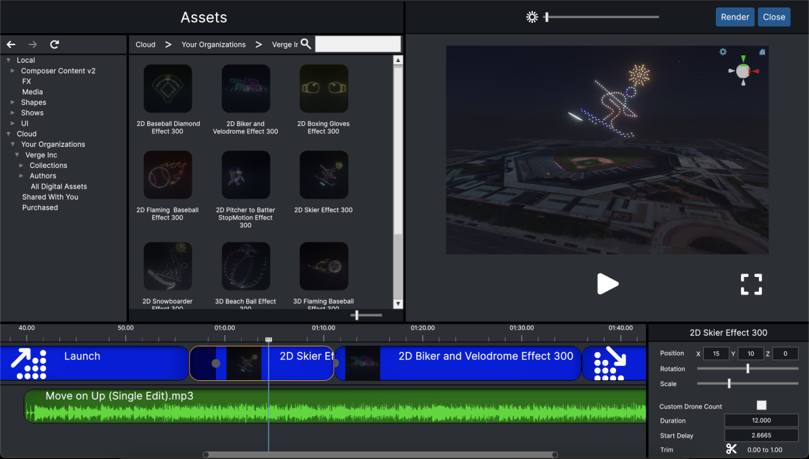
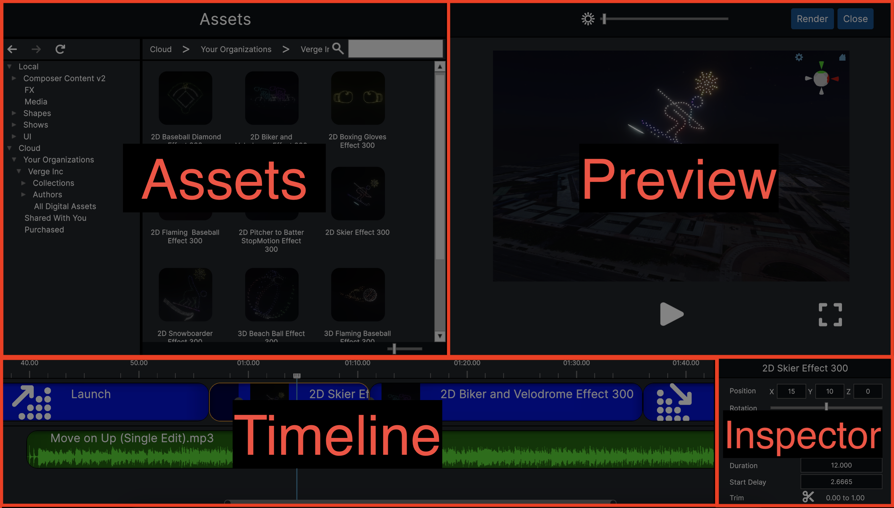
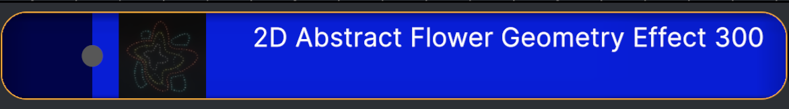
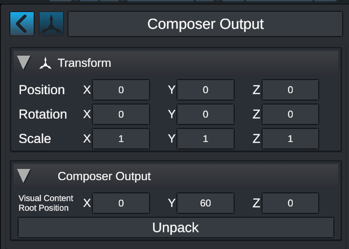

# Composer

The [Verge Aero](https://wiki.droneshow.software/wiki/Verge\_Aero) Composer is a special mode in the [Verge Design Studio](./) that further simplifies the process of creating drone shows. It is designed to be accessible to designers of all skill levels, and requires no prior knowledge or experience with 3D design tools. [Show Effects](show-effects/), the primary building blocks of the Composer, can be drag-and-dropped into the Composer timeline to create unique shows in minutes. As a trade-off for its simplified and expedited show creation process, effect customization in the Composer is significantly more limited than in the [Verge Design Studio](./).

<figure><figcaption>
A Composer design comprising of two Show Effects and one audio track
</figcaption></figure>

### Panels

The Composer comprises of four panels: Assets, Timeline, Inspector and Preview. Show elements (such as [Show Effects](https://wiki.droneshow.software/wiki/Show\_Effects)) are dragged from the Assets panel into the Timeline panel. Selecting an element in the Timeline panel will display additional customization options in the Inspector panel. The Preview panel updates in real time to reflect any changes to the show design.

<figure><figcaption>
The four panels of the Composer: Assets, Timeline, Inspector, and Preview
</figcaption></figure>

#### Assets

The Composer makes use of the [Show Effect Asset Repository](show-effects/show-effect-asset-repository.md) to bring show elements into its design. The Composer can support a variety of asset types, but is best suited for [Show Effects](show-effects/) and audio files (.wav, .ogg, and .mp3).

Other supported files include: non-[Show Effect](show-effects/) .vfab files, .svg and .obj files, and images of type .png, .tga, .jpg, .jpeg, .bmp, .psd, and .gif.

To add an asset into the Composer design, click on an asset and drag it into the timeline panel.

#### Timeline

The timeline is where individual assets are arranged together to create a show. It comprises of one lane of visual content and one lane of audio content, where content within either lane cannot overlap.

**Visual Timeline**

The visual timeline always begins with a 'Launch' element, and always ends with a 'Return' element. Between those two elements, any number of visual assets (such as [Show Effects](show-effects/)) can be added. 'Launch' and 'Return' are unique elements that may behave differently from added visual elements. The descriptions below relate to added visual elements, and the information may or may not apply to these two elements.

<figure><figcaption>
A visual timeline element
</figcaption></figure>

A visual timeline element's duration can be adjusted by clicking and dragging on the right edge of the element. For [Show Effects](show-effects/), this will typically speed up or slow down the effect to match the new duration, but could behave differently depending on the configuration of the effect.

On the left side an element is a circle that can be clicked and dragged to modify the start delay of an element. The start delay is a block of time in which an element's effects are not processed. Effectively, it holds the element's initial state (position, rotation, color, etc) in place until the end of the start delay. For example, consider an element that turns red after 1 second and has a start delay of 5 seconds. It will hold in its initial state for 5 seconds, and then begin processing the element's effects and turn red after 1 more second (6 seconds total). The purpose of start delays is to allow time for drones to transition from one visual element to another. Otherwise, an element's lighting effects may begin before forming the initial shape of the element.

Elements in the visual timeline can be reordered by clicking and dragging the elements.

**Audio Timeline**

The audio timeline is directly below the visual timeline, and is empty by default. Audio elements are added by dragging in audio assets from the Asset panel. Audio cannot be modified in the audio timeline, only added and deleted.

**Controls**

_Set/Scrub Playback Time_ - left click on timeline time area (top)

_Play/Pause -_ Space key

_Scroll Visible Section of Timeline_ - middle mouse button + drag OR drag center of scroll bar at bottom of timeline

_Zoom_ - mouse scroll wheel OR drag endpoints of scroll bar at bottom of timeline

_Select Element_ - left click on element center

_Multi-Select Elements_ - 'Ctrl' + left click

_Adjust Element Duration (Visual Only)_ - left click + drag on right edge of element

_Adjust Element Start Delay (Visual Only)_ - left click + drag on gray circle in element (defaulted to left edge)

_Move Element_ - left click on element center + drag

_Delete Element_ - select element and press 'Del' key on Windows or 'Cmd' + 'Del' on OSX OR right click element and select 'Delete'

#### Inspector

The Inspector panel can be used to modify properties of a visual timeline element. To populate the Inspector panel, select a visual timeline element. The properties in the Inspector can vary depending on element selected.

_Position_ - Modify the X, Y, and Z coordinates of the selected element

_Rotation -_ Modify the rotation (around the vertical axis) of the selected element

_Scale -_ Modify the scale of the selected element

_Drone Count ('Launch' element_) - Set the number of drones in the launch pad. All visual elements will default to this drone count

_Custom Drone Count_ - Toggle on an element to override the 'Launch' element's drone count

_Drone Count (Non-'Launch' element) -_ Set the number of drones assigned to the element, overriding the 'Launch' element's drone count

_Duration_ - Set the duration (in seconds) of an element

_Start Delay_ - Set the start delay (in seconds) of an element (see Visual Timeline section for more information)

_Trim -_ With the Timeline play head over the selected element, click the trim button (scissors) to split the element into two distinct, independent elements. The Trim section in the inspector will reflect the portion of the initial element that the new element represents. Use the Trim tool when only a portion of a [Show Effect](show-effects/) is desired.

#### Preview

The Preview panel reflects the Composer design at a given time. By default, the Preview panel displays the design in 'Preview' mode. This mode is a fairly accurate estimation of what the rendering will look like that updates in real time. After rendering the design, a toggle will appear to enter 'Render' mode. 'Render' mode displays exactly where drones will be at a given time in a design. As a trade-off, 'Render' mode does NOT update in real time. It is recommended to remain in 'Preview' mode while creating and modifying a design, and only using 'Render' mode to validate that a design is executing as expected.

The preview panel's view port window shares the same controls as the [Verge Design Studio's](./) scene view port

_Ambient Light Slider_ - adjusts environment ambient lighting

_Render Button -_ renders the Composer design

_Close Button -_ closes the Composer and returns to the [Verge Design Studio](./)

_Preview/Render Toggle (appears after first render) -_ Toggles between 'Preview' and 'Render' mode

_Play/Pause Button -_ Play/Pause design

_Fullscreen/Minimize Button_ - Expands/minimizes the preview panel

### Relationship with Verge Design Studio (Composer Output)

When creating a Composer design, a Composer Output object is created in the [Verge Design Studio](./). This object contains all of the information related to the Composer design. Only one active Composer design can exist in the [Verge Design Studio](./) at a time, and opening the Composer will either create a new Composer design or open the existing one.

<figure><figcaption>
Composer Output inspector in the <a href="./">Verge Design Studio</a>
</figcaption></figure>

A Composer Output is a self contained object (much like [Show Effects](show-effects/)). In the [Verge Design Studio](./), there are only a few properties that can be modified in the Composer Output: the object's transform and the Visual Content Root Position.

The Transform will move the entirety of the Composer design, including the Launch Pad. The Visual Content Root position will move only the content in the Composer design. All position values within the Composer design are relative to the Visual Content Root Position.

The Composer Output also contains an 'Unpack' button. Clicking this button will make the Composer Output no longer self contained, and the Composer Output will be expanded into a typical [Verge Design Studio](./) show design. This will unlock the Composer design so that it can be customized beyond the capabilities of the Composer. Once unpacked, however, the Composer Output cannot be re-packed. This means that unpacking a Composer Output will make it no longer accessible within the Composer itself, and will only be able to be modified withing the [Verge Design Studio](./).

### Tips

**Expediting the process of creating custom shows in the** [**Verge Design Studio**](./)

The Composer can piece together a simple show much faster than the studio. When designing a highly customized show (and if possible), it may save time to design a show in the Composer and then unpack the Composer Output for further customization. The Composer can lay the basic framework for a show, and allow a show designer to focus on the more intricate and customized sections of a show.

### Troubleshooting

**My Composer design preview appears correct, but when I render, some drones are missing or appear to be stuck near the ground**

Designs in the [Verge Design Studio](./) can interfere with Composer designs if they share the same space. In this case, there is likely another Launch Pad that is blocking the drones in the Composer design. Either move or delete the Launch Pad in the studio to resolve this issue.
