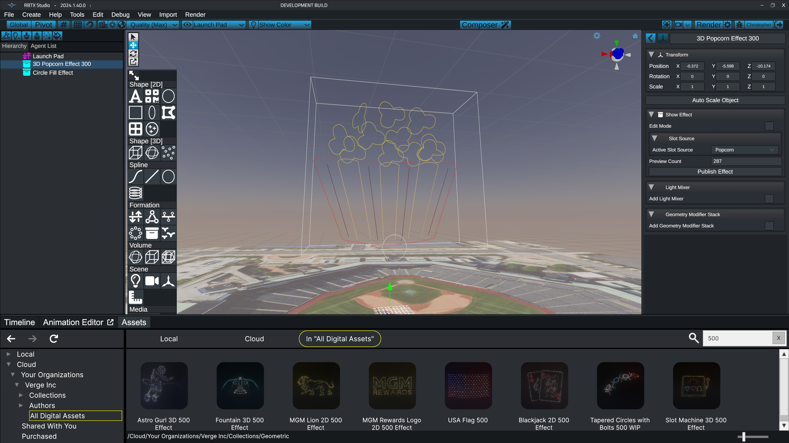

# Show Effects

Show effects provide a convenient way to package complex scene object hierarchies and animation sequences into a single object. They solve issues with scalability and simplify the act of re-using designs in future shows. Show effects are the cornerstone functionality that enable the [Composer](https://wiki.droneshow.software/wiki/Composer) editor.

<figure><figcaption>
Show Effects package complex animation and hierarchy info into a single object
</figcaption></figure>

### Learn How to Use Show Effects

* [Show Effect Asset Repository](https://wiki.droneshow.software/wiki/Show\_Effect\_Asset\_Repository)
* [Converting Scene Objects into Show Effects](https://wiki.droneshow.software/wiki/Converting\_Scene\_Objects\_into\_Show\_Effects)
