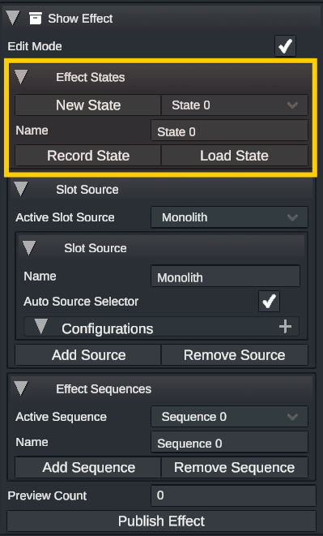

# Show Effect: States

States provides a convenient way to initialize a show effect with a certain set of parameters. The show effect state system leverages the animation system. Any fields that can be animated can be saved as a state. It also provides a way to have multiple, easily-swappable, static configurations of a single set of scene objects without needing to create sequences.

<figure><figcaption></figcaption></figure>

## Recording a State

To create a new save state, make sure that the show effect is in _Edit Mode_. Under the _Effect States_ dropdown, left-click _New State_ to create a new, unpopulated state cache. Set the values that you wish to save to the state (Note: the only parameters that can be saved are those that can be animated). Left-clicking on _Record State_ will save the current values to the selected state. The state can be renamed by modifying the _Name_ field.

## Restoring a State

There are two ways of syncing a show effect and its contents to a state. Any recorded state can be loaded by selecting it from the inspector dropdown and then left-clicking the _Load State_ button. Alternatively, Show Effect State Events can be triggered from the timeline, which allows a state to be loaded when the event is started.

<figure><figcaption>
Two states being loaded back-to-back on the timeline
</figcaption></figure>
