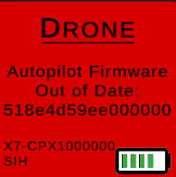

# Firmware - VPKG System

During typical operation, Verge Aero’s drone show system consists of hundreds or thousands of devices that each run their own installation of software/firmware. To maximize success, compatibility, and safety, it is of utmost importance that all devices are synchronized to a single configuration. To accomplish this, the Verge Aero Console provides automated software validation and synchronization tools to alert the pilot of divergences and to simplify the act of mass software updates.

### The VPKG Format

A VPKG is a single file that contains a manifest and packages every binary necessary to update components of the system. By using a single file, human error is minimized and we can ensure that the system state as a whole is always valid. Each VPKG is assigned a single version ID which also simplifies the confusion of differing version numbers and formats across the system. Each entry contains a version number, an MD5 hash for error checking, a component tag, and a name. This file cannot be modified by the user and is provided by Verge Aero on a stable release schedule. Each version of the [Verge Aero Console](./) is shipped with a VPKG embedded to support offline software synchronization. The VPKG format also supports hardware variants by allowing multiple architectures to be represented simultaneously, identified via special tags. For example, AP\_ORANGE\_FW represents an [X1 ](../../drone-show-hardware/drones/x1.md)drone that is running a Cube Orange autopilot hardware module and AP\_X7\_V1\_FW represents an [X7](../../drone-show-hardware/drones/x7.md) running version 1 of its autopilot hardware. This means that a mixed fleet of any number of hardware variations can all be managed and updated simultaneously.

| VPK Metadata                                                                                                                                                                                                                                                                                                                                                                                                                                                                                                                                                                                                                                                                                                                                                                                                                                                                                                                                                                                   |
| ---------------------------------------------------------------------------------------------------------------------------------------------------------------------------------------------------------------------------------------------------------------------------------------------------------------------------------------------------------------------------------------------------------------------------------------------------------------------------------------------------------------------------------------------------------------------------------------------------------------------------------------------------------------------------------------------------------------------------------------------------------------------------------------------------------------------------------------------------------------------------------------------------------------------------------------------------------------------------------------------- |
| 
BundleMetadata:

 FileName: x7_dev-v1_2_2_2

 Label: v1.2.2.2

 Version: 1.2.2.2

 Tags:

 Changelog:

 Path:

 Hash:

 MD5:

PackageContents:

 AP_X7_V1_FW:

   FileName: x2_fc-v1.2.2.2.bin

   Label:

   Version: 1.2.2.2

   Tags:

   Changelog:

   Path: Target/Autopilot/Firmware

   Hash: 518e4d59ee000000

   MD5: 6b43ad0db95fe64f006897ed2195034b

 HM_X7_V1_FW:

   FileName: x2_drone-v1.2.2.2.bin

   Label:

   Version: 1.2.2.2

   Tags:

   Changelog:

   Path: Target/Hivemind/Firmware

   Hash: a10894b3c349afef

   MD5: dffcdab626b4f2aad117f588ba5f2a22

 RPI3B_MAESTROSERVER:

   FileName: maestroserver-1.2.1.8

   Label:

   Version: 1.2.1.8

   Tags:

   Changelog:

   Path: Target/Maestro/MaestroServer

   Hash:

   MD5: 02099e8fb749b9d86679b3a82739cab0
 |

Table 1: Shows an example bundle manifest with an AP build, HM build, and Maestro Server application included

### Updating from the Console

Synchronizing the system to a VPKG is incredibly simple from a user-perspective. The user must ensure that the proper bundle version is loaded into the “Software Bundles” panel, press the “Upload” button, and then verify that they wish to start the upload process. After that, the system automatically handles all necessary update actions. It is still important that the user maintain vigilance and look for inconsistencies.

Figure 2.1: Shows the software bundle panel within the [Verge Aero Console](https://wiki.droneshow.software/wiki/Verge\_Aero\_Console) application. Note that the “Modify Data” toggle is not present on versions available to users outside of the Verge Aero development team.

Figure 2.2: Shows the upload and progress panel that the user sees when performing a system configuration synchronization

#### Drone Version Sync

As part of a drone’s network initialization process, version hashes for the autopilot and companion computer are exchanged. These hashes are unique to each build and provide a snapshot of the software version. The Console application compares the provided hash against the one that is present in the VPKG. If they do not match, then the drone is flagged as “Out of Date” and is not usable until the issue has been resolved.

The update process operates as follows:

* The VPKG file is uploaded to the fleet
* The VPKG and contained binaries are verified via the MD5 hashes contained in the manifest
* The drones are instructed to synchronize themselves to the uploaded VPKG
  * Each drone is aware of which tags it must use to located the appropriate architecture’s binary
* The companion computer transfers the autopilot firmware image to the autopilot computer and initiates the bootloader to begin flashing that image
* The companion computer enters into a bootloader state and begins flashing its own firmware

Figure 3.1: Shows the inspector panel for an X7 drone with fields for hivemind (CC) and autopilot firmware hashes

<figure><figcaption>
Shows a device grid error stating  that the autopilot firmware  does not match the loaded package’s firmware
</figcaption></figure>

#### Managing [Autopilot](../../drone-show-technology/autopilot/) Parameters

[PX4](../../drone-show-technology/autopilot/px4.md) is configurable via parameters that affect flight characteristics, sensor configuration, and mission behaviors. Parameters may be set independently from firmware installation and this can lead to inconsistencies. Additionally, some parameters must differ between devices as they are used to store individualized calibration data. To eliminate this inconsistency, the drone command computer contains a white list of parameters that are maintained between updates (calibration parameters) and all other parameters are reset to defaults that are embedded directly into the autopilot firmware build. As an additional safety measure, parameters that are expected to be identical between all drones are hashed and checked against a master parameter file within the VPKG file.

Figure 4.1: Shows a device grid error stating that the parameter hash does not match the expected value in the VPKG file

#### [Maestro Server](https://wiki.droneshow.software/wiki/Maestro\_Server)

The Maestro server runs a standardized, unchanging linux distribution. Software is deployed and executed via transferred applications. When connecting to the maestro server, the Verge Aero Console checks the versions of the applications that are currently running. If they diverge, the Console alerts the user that it is out of date. The Console can then upload the version present in the VPKG and reboot the Maestro server to apply changes.

<figure><figcaption>
Shows the case where the Maestro version does not match the expected value in the VPKG file
</figcaption></figure>

#### [AT86](../../drone-show-hardware/networking/at86-gateway.md)/[LoRa](../../drone-show-hardware/networking/lora-gateway.md) Gateways

All communication hardware contains a bootloader that allows the Verge Aero Console to perform updates remotely. The process is nearly identical to the Maestro Server process. A Telnet session is established to each connected gateway and the version is read automatically. If the version does not match the version contained within the VPKG, then the user is alerted and they may execute the process to update the device.
