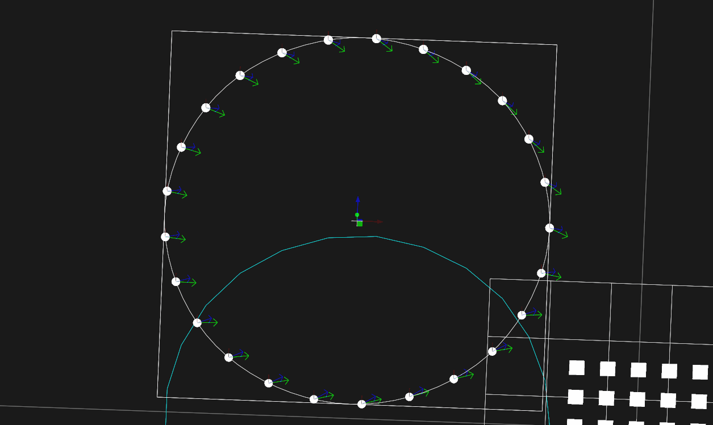

# Yaw Control

There are multiple payload options (such as Pyro) that benefit from the ability to point drones in specific directions. The design studio has support for automating drone yaw based on shape information such as normal or tangent vectors.

## Enabling Yaw Control

To activate yaw control, go to the launchpad inspector and make sure that "Use Default Agent Config" is unchecked. Set "Payload Mount" to "Yaw".

<figure><figcaption></figcaption></figure>

## Payload Target Events

To create yaw targets, a tracked shape must contain a _**Geometry Payload Layer**_ with _**Payload Target Events**_. _**Geometry Payload Layers**_ can be placed inside of a _**Geometry Light Mixer**_ component.&#x20;

<figure><figcaption></figcaption></figure>

There are multiple event types that provide flexible ways of turning drones.

* World Target
  * Face all drones toward the center of a scene object. This object can be animated to dynamically shift drones as the scene object moves
* World Vector
  * Face all drones in a specific direction
* Local Rotation
  * Face all drones with an optional offset relative to the tangent vector of the current slot
* Dynamic Rotation
  * Animatable version of the local rotation effect with options for looping and phase offsets

<figure><figcaption>
An example of drones turning to face a world target in the scene
</figcaption></figure>

## Transitions

All Payload Target events also handle transitions by spending the first x% of the event easing into the new rotation. The percentage as well as the easing method is configurable.

<figure><figcaption></figcaption></figure>
