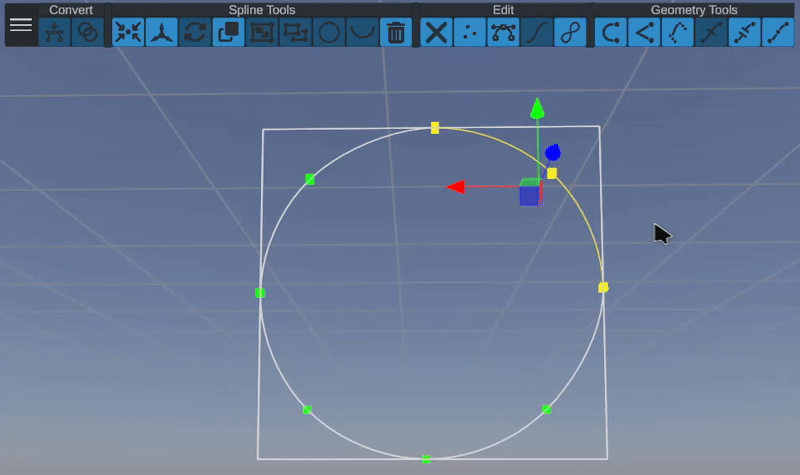
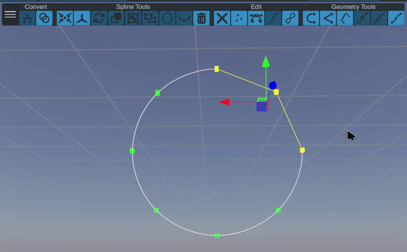
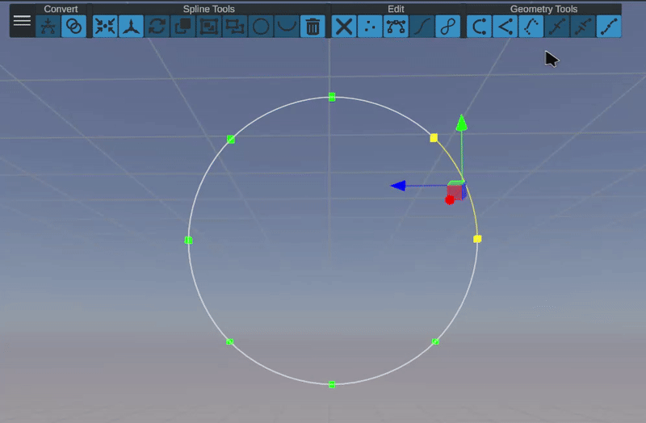
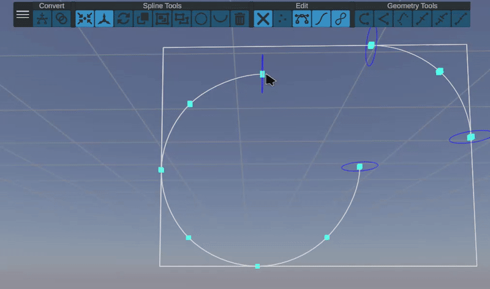
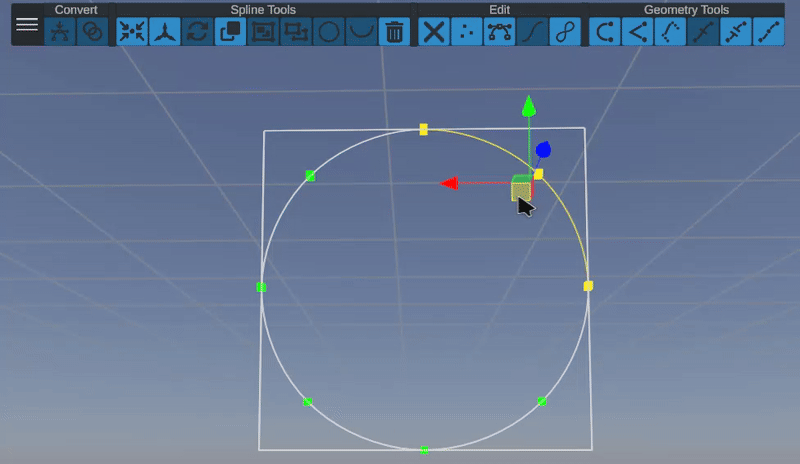
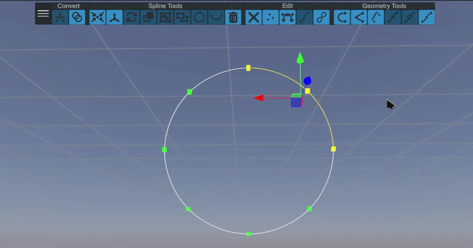
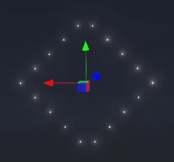

# Spline

A spline is a curve or collection of continuous curves that are defined by a set of (in this case) 3D points. Unlike point clouds, splines are an excellent type of geometry for drone formation definition because they can be split up infinitely to support any number of drones.&#x20;

## Spline Shapes

There are multiple spline-based shapes that can be generated/manipulated with simple parameters. Any of these shapes can be converted into an "Editable Spline" by selected the associated button in the spline edit toolbar.

These shapes include:

* [Bezier Circle](bezier-circle.md)
* [Bezier Helix](bezier-helix.md)
* [Bezier Line](bezier-line.md)

## Color

Splines can be assigned solid colors, or gradients. If a gradient is assigned, then the gradient will be applied along the spline in order from the start to end.

## Editing Splines

When selecting one or more splines, spline shapes, or compound splines, a toolbar will appear on the top of the scene view. This toolbar provides quick ways of manipulating splines, editing geometry, and managing groupings. Buttons become enabled/disabled based on the current selection and state of the splines.

<figure><figcaption>
The spline toolset panel
</figcaption></figure>



These buttons are responsible for changing a shape into another shape container. Some tools and options are not available unless a bezier shape is converted into an editable spline or the shape is a compound spline.

 To Editable Spline

Convert a bezier shape into a form that can be manually editable. This will cause the shape to lose its unique parameters in favor of a generic spline

 To Compound Spline

Convert a bezier spline or shape into a compound spline, supporting multiple splines in a single shape




This set of tools provide high-level ways of manipulating one or more splines. They also expose ways of grouping/ungrouping splines into and out of compound splines.

 Center Anchor

Automatically shift the shape's centroid to be the average of all spline control points

 Shift Anchor

Enter a mode where the anchor can be shifted while keeping the spline's geometry world-locked. To stop anchor shifting, the button must be toggled again.

 Reverse

Reverse the order of the points in the spline. This will result in an identical spline, but with start and end points reversed. Useful for ensuring that lighting effects move in the correct direction

 Reverse

Reverse the order of the points in the spline. This will result in an identical spline, but with start and end points reversed. Useful for ensuring that lighting effects move in the correct direction

  Duplicate

Duplicates the selected spline/s. This only works for compound splines. The duplicated spline will appear as a new sub-spline.


Spline must be converted to a compound spline to use the Duplicate tool


<figure><figcaption></figcaption></figure>

  Merge (Group)

Combines the selected splines into a single compound spline.&#x20;

  Separate (Ungroup)

Removes the selected splines from their current compound spline and puts them into separate standalone splines.

  Close

Forces the spline to be a complete loop. The endpoint will be shifted to be placed on top of the start point.

  Open

Allows the spline start and end points to be separated

  Delete

Deletes the currently selected anchor point, segment, or spline




This button array provides a way to choose selection mode as well as entering/exiting spline edit mode. Edit mode must be entered to modify spline anchor points or use the geometry tools

  Edit Mode (Exit Edit Mode)

Enter edit mode and allow geometry to be selected and manipulated. The button will toggle to an X when active and must be clicked again to exit edit mode.

 Anchor Point/Vertex Selection Mode

Enter anchor point selection mode where only anchor points (points that lie directly on geometry) can be selected

 Control Point/Handle Selection Mode

Enter control point selection mode where any control point can be selected and shifted

 Segment Selection Mode

Enter segment selection mode where any segment can be selected and shifted

 Spline Selection Mode

Enter spline selection mode where any spline can be selected and shifted





 Smooth Geometry

Takes all selected geometry and sets it to be as smooth as possible by adjusting spline control points to be tangential and parallel

<figure><figcaption></figcaption></figure>

 Straighten Geometry

Takes all selected geometry and sets it to be as straight or sharp as possible by adjusting spline control points to be coincident (or on top of eachother) for each anchor point

<figure><figcaption></figcaption></figure>

 Extrude Geometry

Takes selected segment (or vertex if on an endpoint) and creates a new line on each side so that it may be pulled away without disturbing surrounding segments

<figure><figcaption></figcaption></figure>

 Merge Geometry

Fuses two selected endpoints to form a single spline

<figure><figcaption></figcaption></figure>

 Split Geometry

Takes selection and breaks its endpoints from the containing spline. This will create new splines to properly contain the new separated segments.


Spline must be converted to a compound spline to use the Split tool


<figure><figcaption></figcaption></figure>

 Subdivide Geometry

Takes the selected segments and evenly subdivides them, inserting a single new vertex per-segment for every click

<figure><figcaption></figcaption></figure>




## Slotting Control

<figure><figcaption></figcaption></figure>

## Pivot Weighting

The design studio leverages geometric information to make decisions around where to place slots. In the case of a spline, harsh angles or "corners" can be treated specially and the software well make sure that a drone is placed exactly on the corner. This will maximize detail and definition.

<figure><figcaption>
Pivot weighting on (Left) and off (right)
</figcaption></figure>

`Use Pivot Weighting:` Enable/Disable the use of pivot weighting in the slot solution

`Pivot Angle Threshold:` The angle (in degrees) that a corner must be _below_ in order for it to be treated as a pivot point

## Partial Spline

The slot solver can be set to use _only a portion_ of a spline. This is particularly useful in combination with animating the slot offset field if you want to move a group of splines along a path.


You must disable pivot weighting in order to use partial spline functionality


<figure><figcaption></figcaption></figure>

`Use Partial Spline:` Enable/Disable the use of a partial spline

`Start Percent (%):` The location (in percent, where 0% is the start and 100% is the end) to start the spline&#x20;

`End Percent (%):` The location (in percent, where 0% is the start and 100% is the end) to end the spline&#x20;

<figure><figcaption>
Shifting end percent from 100% to 0%
</figcaption></figure>

## Hull Slot Solver

Along with the standard linear solver, there is also a mode that allows a spline shape to be filled in.

<figure><figcaption></figcaption></figure>

<figure><figcaption></figcaption></figure>

### **Hull Projection Axis**

* **Description**: Specifies the axis along which the spline is projected to compute the 2D hull for slotting.
* **Options**:
  * **X**, **Y**, **Z**: Choose the axis orthogonal to the hull's plane. Used to flatten 3D splines into a 2D working surface.

### **Slot Mode**

* **Description**: Determines the algorithm used to generate the filled surface inside the spline’s hull. This affects how vertices are distributed across the area enclosed by the projected hull.
* **Options**:
  * **Scaled Fit**
    * Fills the convex or concave polygonal region and then _stretch_ them so that points touch the boundary of the shape
    * Ideal for structured interpolation and clean, regular fills.
    * Can set the number of columns/rows directly or define a density for placement
  * **Poisson Distribution**
    * Inserts vertices using a Poisson disk sampling method.
    * Ensures randomly distributed points with a minimum distance between them, avoiding clumping while preserving uniformity.
    * Best suited for naturalistic or non-uniform point distributions (e.g., organic modeling, scattered elements).
    * Row and scanline settings are ignored in this mode.
    * Density controls how close/far points are distributed
    * Random seed can be tweaked to get slightly different distributions
  * **Bounded Grid**
    * Fills the hull area with a regular grid of points, clipped to the boundary of the projection.
    * Produces a structured mesh of evenly spaced rows and columns, spacing is identical vertically and horizontally.
    * Works well for mechanical or architectural shapes requiring evenly spaced subdivisions.
    * Density controls how close/far points are distributed
