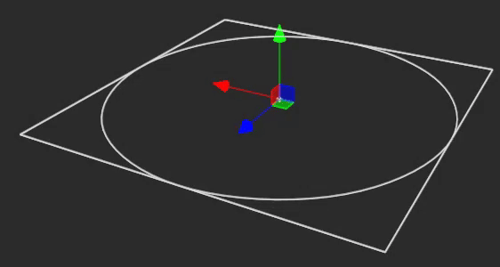

# Bezier Circle

### Bezier Circle

A Bezier Circle shape provides a circle made of multiple bezier splines placed equally around its perimeter. This is not to be confused with the standard 2D circle available from the shape palette which is a simple geometric model of a circle.

| Parameter   | Type                      | Description                                                                                                                                                                                          |
| ----------- | ------------------------- | ---------------------------------------------------------------------------------------------------------------------------------------------------------------------------------------------------- |
| Radius      | Decimal (Meters)          | The distance from the center of the helix to the horizontal extends of the helix                                                                                                                     |
| Circularity | Decimal (0-2)             | A rating of anchor weighting to provide different levels of smoothness. 2: the shape is smoothed at its control points. 1: The shape is perfectly circular. 0: The shape is made of straight lines   |
| Segments    | Integer                   | The number of spline segments to use for each turn                                                                                                                                                   |
| Start Angle | Decimal (Degrees)         | Indicates the starting angle (around the centroid) that the circle starts.                                                                                                                           |
| Arc Length  | Decimal (Degrees) (0-360) | The positive or negative number of degrees that the circle spans                                                                                                                                     |

<figure><figcaption>
The inspector for a Bezier circle
</figcaption></figure>

<figure><figcaption>
Arc Length being manipulated between 0 and 360 degrees
</figcaption></figure>
