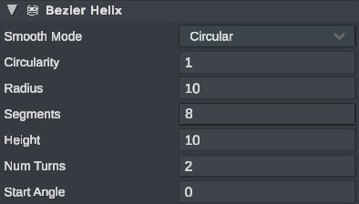

# Bezier Helix

### Bezier Helix

A Bezier Helix shape provides an upward spiral with a constant radius.&#x20;

| Parameter   | Type                             | Description                                                                                                                                                                                          |
| ----------- | -------------------------------- | ---------------------------------------------------------------------------------------------------------------------------------------------------------------------------------------------------- |
| Smooth Mode | Options (Smooth, Circular, Hard) | Choose an option to automatically assign a circularity to Smooth (2), Circular (1), or Hard (0)                                                                                                      |
| Circularity | Decimal (0-2)                    | A rating of anchor weighting to provide different levels of smoothness. 2: the shape is smoothed at its control points. 1: The shape is perfectly circular. 0: The shape is made of straight lines   |
| Radius      | Decimal (Meters)                 | The distance from the center of the helix to the horizontal extends of the helix                                                                                                                     |
| Segments    | Integer                          | The number of spline segments to use for each turn                                                                                                                                                   |
| Height      | Decimal (Meters)                 | The distance from the bottom of the helix to the top of the helix (y-axis)                                                                                                                           |
| Num Turns   | Decimal                          | Represents the number of circles that the helix is made up of. Can support partial loops                                                                                                             |
| Start Angle | Decimal (Degrees)                | Indicates the starting angle (around the centroid) that the helix starts.                                                                                                                            |

<figure><figcaption>
Inspector for a Bezier Helix
</figcaption></figure>

<figure><figcaption>
A Bezier Helix with the num turns field being adjusted
</figcaption></figure>
