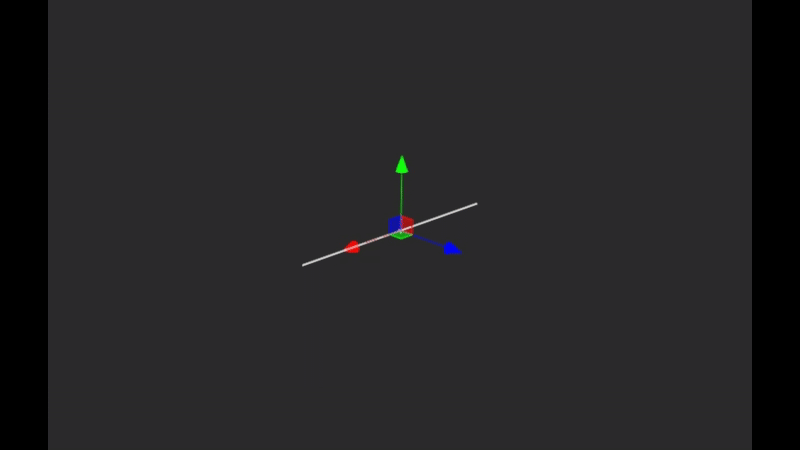

# Bezier Line

### Bezier Line

A Bezier Line is the simplest spline shape. It consists of two points with a single segment connecting them.&#x20;

| Parameter | Type             | Description                                                               |
| --------- | ---------------- | ------------------------------------------------------------------------- |
| Length    | Decimal (Meters) | How long the line is, with the centroid located at the middle of the line |
| Segments  | Integer          | The number of spline segments to use for each turn                        |

<figure><figcaption></figcaption></figure>

<figure><figcaption></figcaption></figure>
