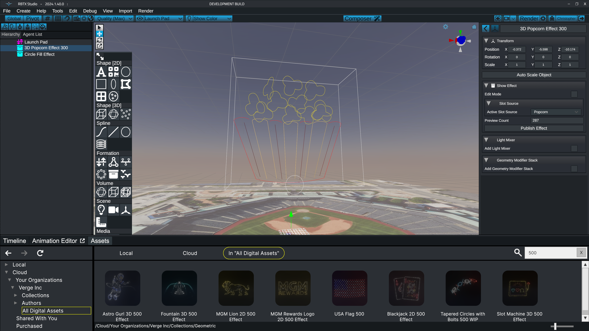

# Show Effects

Show effects provide a convenient way to package complex scene object hierarchies and animation sequences into a single object. They solve issues with scalability and simplify the act of re-using designs in future shows. Show effects are the cornerstone functionality that enable the [Composer](https://wiki.droneshow.software/wiki/Composer) editor.

<figure><figcaption>
Show Effects package complex animation and hierarchy info into a single object
</figcaption></figure>

### [Show Effect Sequences](show-effect-sequences.md)

Sequences provide for a method of animating one effect in many different ways, supplying the user with a way to choose from a number of looks embedded in a single object.&#x20;

### [Show Effect States](./#show-effect-states)

States provides a convenient way to initialize a show effect with a certain set of parameters. Typically they are used to place an effect into a starting state to be used with a sequence.

### [Show Effect Asset Repository](show-effect-asset-repository.md)

The Verge Design Studio has a built-in cloud repository where show effects can be published, shared, and downloaded, all with version-control.

### [Creating Show Effects From Existing Scene Objects](converting-scene-objects-into-show-effects.md)

Show Effects were introduced in version 2024.1. There are automated tools to convert legacy objects into show effects to simply using the new workflow.
