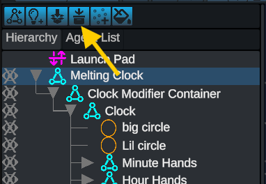

# Converting Scene Objects into Show Effects

### How To

It is incredibly easy to take immediate advantage of the show effect system added in 2024.1. Any existing effect can be converted to a show effect with a couple of clicks.

1.  Select the top level object that you wish to convert into an show effect

2.  In the button panel above the object hierarchy, click on the icon showing the show effect symbol with an arrow pointing downward.

3.  The entire hierarchy under the target object will now be condensed into a single show effect. This effect can be published, shared, and transported as normal

<figure><figcaption>
Select the top level object that you wish to convert into an show effect and click the convert button
</figcaption></figure>

<figure><figcaption>
The entire hierarchy under the target object will now be condensed into a single show effect. This effect can be published, shared, and transported as normal
</figcaption></figure>

### Additional Notes

By default, the resulting show effect will have a single sequence, and a single slotting source

* The resulting effect will automatically choose the top-level object as the slotting source. When converting a complex object, it is most convenient to make your top-level object a formation group or formation sequence.
* All animations and events contained in the show effect hierarchy will be collapsed into “Sequence 0”. The sequence will automatically be scaled to the exact time length of the contained events. The collapsed events will also automatically be shifted so that the sequence starts at 0 seconds.

<figure><figcaption>
A screenshot of the timeline after converting a scene object into a show effect
</figcaption></figure>
