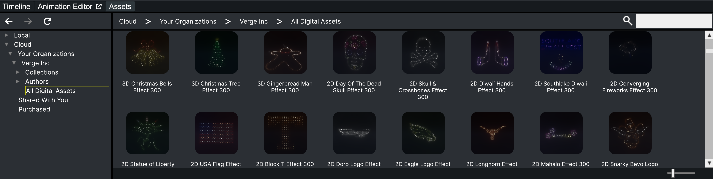
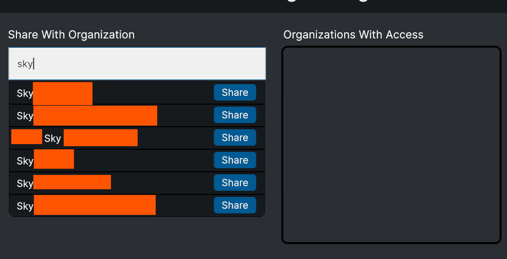
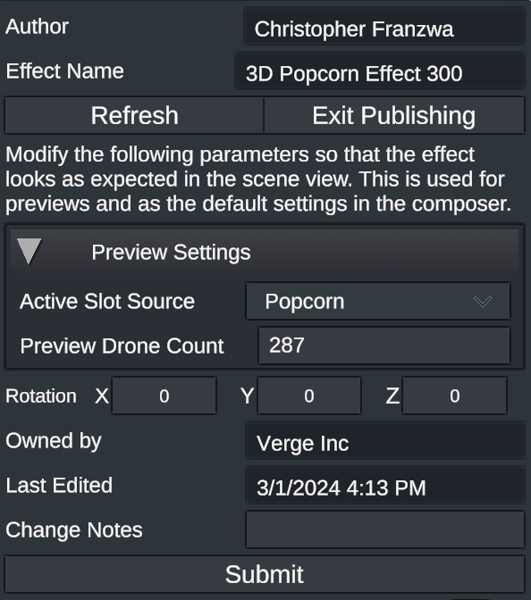

# Show Effect: Asset Repository

Verge Aero’s design studio has a built-in, cloud-enabled solution for managing and sharing drone show effects within an organization. The asset repo also supports versioning which ensures that shows designed in the past are not accidentally impacted when publishing updates to existing effects.

#### Account Login

First, make sure that you are properly logged in with a valid Verge Aero account. For more information about logging in to your account, go [here](https://wiki.droneshow.software/wiki/Verge\_Aero\_Account). It is important to ensure that you are logged in on the Design Studio application, which requires separate steps than logging in on the toolbox. To use the asset repository, you must also belong to an organization with an active software license. If you do not already belong to an organization, contact your org admin and ask that they add you.

### The Repository Browser

The asset repository browser can be found by navigating to the [Assets](https://wiki.droneshow.software/index.php?title=Assets\&action=edit\&redlink=1) tab right above the timeline. Within the [Assets](https://wiki.droneshow.software/index.php?title=Assets\&action=edit\&redlink=1) tab are two dropdowns, the [Local](https://wiki.droneshow.software/index.php?title=Local\&action=edit\&redlink=1) browser and the [Cloud](https://wiki.droneshow.software/index.php?title=Cloud\&action=edit\&redlink=1) browser. The [Local](https://wiki.droneshow.software/index.php?title=Local\&action=edit\&redlink=1) browser will show any assets that are located in the Show Designer documents folder. To get to the repository browser, expand the [Cloud](https://wiki.droneshow.software/index.php?title=Cloud\&action=edit\&redlink=1) dropdown.

Under "Your Organizations", you should see a dropdown for each org that you are a member of. Navigating to "All Digital Assets" will show all effects that are currently accessible to you. There are additionally breakdowns by Author and Collection.

<figure><figcaption>
Left-click and drag an effect into the scene view to import
</figcaption></figure>

To import a show effect, simply left click and drag the effect into the scene view. There is also a search bar (located in the upper right corner of the asset browser) that can be used to look for specific effects.

#### Using Effects Offline

Although it is a cloud feature, the show effect repo can be used offline if you prepare for the situation beforehand. It should also be noted that as long as you’ve loaded and viewed the effects once, they can then be accessed without an internet connection. If you wish to prepare a show effect for use offline, you can right-click on any effect or collection in the browser and select \*Cache\*.

<figure><figcaption>
Right-click on a collection or show effect and click "Cache" to store it locally
</figcaption></figure>

Once cached, the current state of the selected collection or effect will be saved on your machine. You will be able to freely use show files referencing those show effects or import for new shows.

### Managing Show Effect Collections

Show effect collections are, in essence, folders that contain any number of grouped effects. One effect may belong to multiple collections. Collections provide a convenient way to group effects by concept, drone count, year, and more. A new collection may be created by navigating to the "Collections" dropdown in the cloud browser hierarchy, right-clicking in the folder view, and selecting "Create Collection". Once created, you may rename the collection by right-clicking on it and selecting the appropriate option.

#### Deleting a Collection

You may delete a collection by right-clicking on it and choosing "Delete". You can only delete the collection if you are part of the owning organization. Deleting a collection _will not_ delete the contained effects. If you lose track of an effect, then you can select "All Digital Assets" in the asset hierarchy to find it.

#### Sharing Effects with Another Organization

<figure><figcaption>
Right-click on a collection and choose "Share". Search for and choose an organization to share your collection with.
</figcaption></figure>

Effects cannot be shared on their own with another organization. You can, however, share collections. After identifying the collection you would like to share, or creating a new one with intention of sharing, right-click on that collection and choose "Share" from the dropdown. A window will then appear that will allow you to search for other organizations using the Verge platform (censored above for privacy). Selecting "Share" next to the organization name will then provide read-only access to that org for the selected collection. Any effects that you add, remove, or update from the shared collection will be updated for shared orgs appropriately.

### Publishing Show Effects

After creating a new effect, or [converting an existing scene object](converting-scene-objects-into-show-effects.md), show effects can be published to an organization's asset repo by clicking on the "Publish Effect" button in the object's inspector. The publish view will provide a preview of the thumbnail and a set of options to modify the preview. You may choose an active slot source, a preview drone count, and a rotation. If you are a part of multiple organizations, you may choose which org you wish to publish the effect to. Additionally, you must choose a collection to save the effect to. Make sure that you have at least one collection created before publishing an effect. You may add the effect to multiple other collections after publishing.

#### Creating a New Version of a Show Effect

To create a new version of an existing show effect, you must first unpack the show effect. Unpacking can be done by selecting a show effect, navigating to the inspector, and clicking the "Unpack" button. Once unpacked, you may freely modify the show effect. To upload modifications, follow the same steps as would be performed when publishing a new effect. The publish panel will look slightly different; you will be unable to modify the effect name, author name, or owner. Click "Submit" to upload the new version.


The new version will take the place of the previous version in the asset browser. Any saved show will save a reference to the show effect _and_ the version of that effect that was used. This way, if you update the show effect, it will not have any impact on previously designed shows.&#x20;


<figure><figcaption>
The publish panel for a new version of a "Popcorn" show effect
</figcaption></figure>

#### Sharing Show Files that Contain Cloud Show Effects

When a show effect is used in a show that has been imported directly from the effect repo, the effect data is not stored inside of the show file. Instead, a reference to that show effect is saved which can be used to automatically import the effect on any target machine. This is also true for packed show files. Opening a show file correctly requires an active internet connection and that the user has permissions to access any contained show effects. If you wish to avoid this or are working in conditions that do not allow it, then you must _Unpack_ the effect before export.
