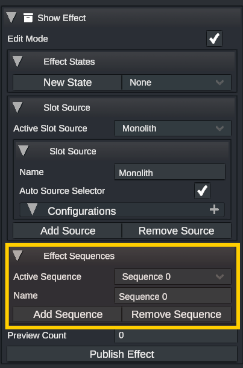

# Show Effect: Sequences

Sequences provide for a method of animating one effect in many different ways, supplying the user with a way to choose from a number of looks embedded in a single object.&#x20;

A show effect can have a virtually unlimited number of sequences. Each sequence represents a completely separate set of timelines and events.

## Creating a Sequence

First, ensure that the show effect is in _Edit Mode_. A new sequence can be added by clicking on the "Add Sequence" button in the Show Effect inspector view. After creating a new sequence, click on the "Active Sequence" dropdown and select the new sequence to modify it. The name can then be freely edited via the "Name" field. The timelines for all scene objects inside of the show effect will be cleared and the sequence may be built as desired.

<figure><figcaption></figcaption></figure>

## Removing a Sequence

Removing a sequence is equally simple as creating one. Once in _Edit Mode_, set the "Active Sequence" to the sequence that you wish to delete. Click the "Remove Sequence" button to delete all contents of that sequence.

## Modifying a Sequence

To select any objects or timelines in the Show Effect, it must be in _Edit Mode._ The "Active Sequence" dropdown can be used to select which sequence will be edited. Events can be modified in the same way that any other event or timeline is manipulated when in _Edit Mode_. Note that when in this mode any sequence events on the Show Effect are disabled and the all events in the sequence will be played relative to the global time.&#x20;

## Playing a Sequence

1. Add a Show Effect Channel to a Show Effect
2. Right-Click -> Insert Event -> Effect Sequence Event
3. Select your desired sequence via the "Targeted Sequence"

A sequence event will take a target sequence and play back the contained timelines where the start of the event corresponds to 0 seconds on the target timeline. Shifting the sequence up and down the timeline will also shift the start time of the timelines. This makes the act of lining up animations very straight-forward

## Sequence Event Options

### Reset Sequence Length

This button will resize the sequence event to match the time length of the contained sequence. So if, for example, the sequence is a rotation that lasts from 0 to 30 seconds and then flashing lights until 45 seconds, then the event will resize to 45 seconds.

### Normalized Playback

Default: _Enabled_

This is a togglable option that will scale the sequence in _time_ based on how short or long the sequence event is set to, speeding it up or slowing it down appropriately. This will ensure that no matter how long the event is, the sequence starts at the beginning and ends when the event is finished. This is a convient way to re-time complex sequences without needing to scale all contained events independently. When disabled, the sequence will play at a standard 1x speed, regardless of length. So if the event is shortened to half of the sequence's length, then only half of the sequence will be played.

### Trim Empty Time

Default: _Enabled_

When enabled, this will remove all time at the start of a sequence where no events are occurring. This will force a sequence to be played back relative to the start of the first event instead of the start of the timelines.

### Start Offset

Default: 0

This is a _normalized_ offset for the start of a sequence where 0 corresponds to 0% and 1 corresponds to 100%. Shifting this up or down will trim more or less of the start of a sequence away.

### End Offset

Default: 1

This is a _normalized_ offset for the end of a sequence where 0 corresponds to 0% and 1 corresponds to 100%. Shifting this up or down will trim more or less of the end of a sequence away.
