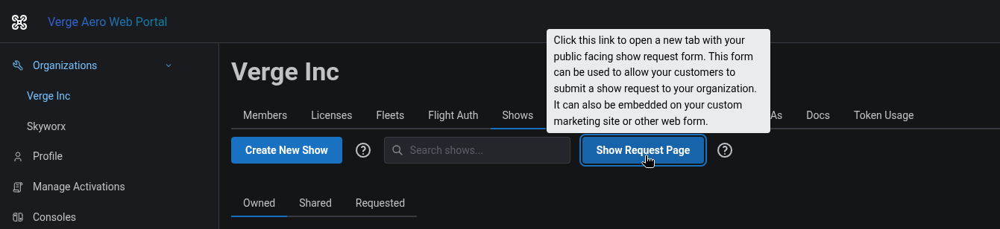
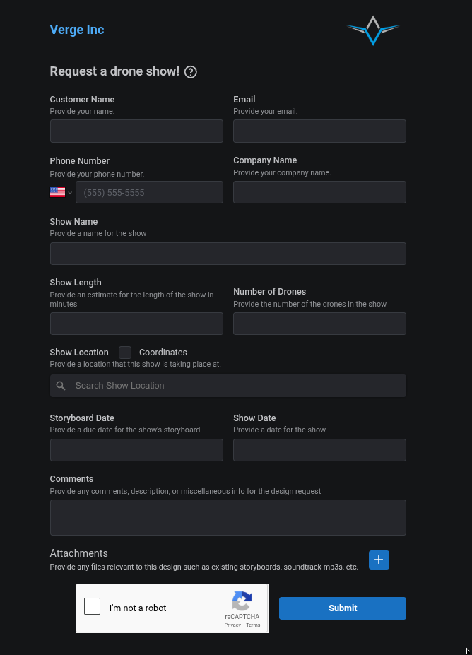
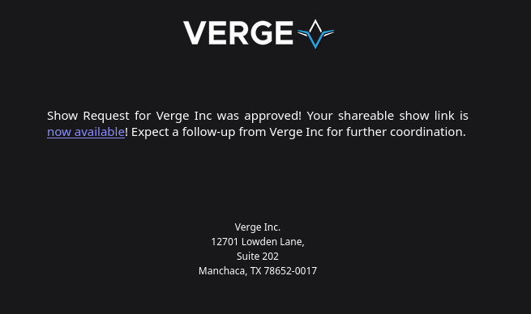
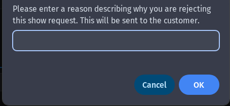

# Utilizing Show Requests

Verge's Show Request page is a simple, straight-forward web form that can be utilized to send a shareable link to customers or prospective customers who would like to request shows from your organization.

A link to your organization's show request form can be accessed from a top level button under the "Shows" tab.

<figure><figcaption></figcaption></figure>

This will take you to your organization's custom branded marketing page. Each organization has their own branding, logo, website, etc. on their respective&#x20;

<figure><figcaption></figcaption></figure>

This page can also be embedded into a website or other web application for easier use.

Utilizing this form allows you to streamline the process of receiving and managing show requests from customers and prospective customers, keeping all of the information in one place.

Once a show request is submitted, it will show up within your Organization's Shows, under the "Requested" tab.

<figure><figcaption></figcaption></figure>

If you decide to approve the show request, the show will immediately show up in your organization's list of shows and a corresponding shareable link will be emailed out to the customer.

<figure><figcaption></figcaption></figure>

If, instead, you decide you cannot accommodate this customer's request, you can simply decline the request via the Requested tab within your organization's Shows and the customer will not be notified.

<figure><figcaption></figcaption></figure>
