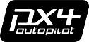

# PX4

## What Is PX4?

According to the the Dronecode Foundation, PX4 is an open source flight control software for drones and other unmanned vehicles. The project provides a flexible set of tools for drone developers to share technologies to create tailored solutions for drone applications. PX4 provides a standard to deliver drone hardware support and software stack, allowing an ecosystem to build and maintain hardware and software in a scalable way.

<figure><figcaption>
The PX4 Logo
</figcaption></figure>

[PX4 Homepage](https://px4.io/)

### How Verge Aero Uses PX4

PX4 is one half of the software stack on the [X1](../../drone-show-hardware/drones/x1.md) and [X7](https://wiki.droneshow.software/index.php?title=X7\&action=edit\&redlink=1) drones. PX4 operates as the drone's [autopilot](./) and is responsible for providing the logic to fuse sensor data, and for getting the drone from point A to point B. Verge Aero does _not_ use PX4's mission system and instead offloads all flight control responsibility to the companion computer, also referred to as [Hivemind](https://wiki.droneshow.software/index.php?title=Hivemind\&action=edit\&redlink=1). If you would like to read more about how the choreography system works, see [this article](https://wiki.droneshow.software/index.php?title=The\_Choreography\_System\&action=edit\&redlink=1).

#### Isolating the Autopilot

All [Verge Aero](https://wiki.droneshow.software/wiki/Verge\_Aero) drones contain two independent processors, one of which is dedicated entirely to PX4. This architectural approach is far less common in lightshow drones, as most merely modify PX4 to add some basic functionality to support lightshow-specific operations (like setting the LED color). This is most often the case because software developers and hardware manufacturers in the lightshow industry are predominately separate companies. There are some massive advantages to isolating Verge Aero custom code from PX4.

**No Single Point of Failure**

Several airspace authorities dictate that there may exist no single point of failure on a drone that could lead to its operation outside of a flight volume. PX4 does provide a way to load a geofence, however the failure to set this geofence could potentially lead to a fly-away condition. Additionally, situations in which PX4 is incorrectly deciding to move outside of the operational area would be left unchecked without oversight. Most authorities are satisified with the provision of an external "button" or interface to swiftly kill a drone if it were to exit the flight area. The issue with this is that it is difficult or impossible to identify a specific drone in any acceptable time and the solution is often to simply terminate the _entire_ swarm. This is obviously a catastrophic scenario and could be incredibly costly. By building in a separate processor with independent logic, we essentially earn an onboard co-pilot that can act as a second layer of defense and automatically land the drone if necessary. This means that the pilot on the ground never needs to intervene. This aspect is a cornerstone to the [design verification report](https://www.easa.europa.eu/en/domains/drones-air-mobility/operating-drone/specific-category-civil-drones/design-verification-report) satisfying [enhanced containment](https://www.easa.europa.eu/en/document-library/product-certification-consultations/final-means-compliance-light-uas2511-moc-light) provided to Verge Aero for the [X7](https://wiki.droneshow.software/index.php?title=X7\&action=edit\&redlink=1) platform. To learn more about Verge Aero's safety system, see [this article](https://wiki.droneshow.software/wiki/System\_Safety\_Architecture).

**"Crashes" Do Not Equal Crashes**

PX4 is a well-maintained and broadly-used code base. Because it is used by so many organizations and independent contributors, there is a high degree of confidence in the stability and robustness of the platform. Any special logic or code introduced by a third party threatens to compromise that stability. _If code running on the PX4 stack causes a memory leak or accesses memory incorrectly, then it could hard fault. A hard fault on PX4 eliminates all motor control and will cause the drone to fall out of the air._ Since Verge Aero shifts all custom logic to a separate processor, then a worst-case scenario means that the drone will cease to receive commands and autoland in a controlled manner. The drone will be undamaged and can be investigated for issues.

**Plenty of Processing Overhead**

The X1/X7 FMU follows the Pixhawk v6X standard. This standard specifies an architecture with an [STM32H7](https://www.st.com/en/microcontrollers-microprocessors/stm32h7-series.html) series processor at its core. There are multiple features that require the memory or processing capabilities of the H7 that the previous standard, the [STM32F7](https://www.st.com/en/microcontrollers-microprocessors/stm32f7-series.html), does not offer. PX4 will continue to be developed with these specs in mind. By separating out Verge Aero's autonomy systems, we can ensure that we do not encroach on the processing requirements of the core PX4 codebase. We also ensure that the platform can continue to be supported for the forseeable future.

**Easy Upgrades**

Because Verge Aero's software is not integrated directly into PX4, it is far easier to stay up-to-date with the latest PX4 versions. As long as the interface that exists between the two software packages doesn't change, [Hivemind](https://wiki.droneshow.software/index.php?title=Hivemind\&action=edit\&redlink=1) is completely unaware of the change and can continue to operate the same way. Additionally, software updates can be managed and performed onboard rather than requiring a wired connection. To learn more about software updates, see the article on the [VPKG system](../../drone-show-software/verge-console/firmware-vpkg-system.md).
