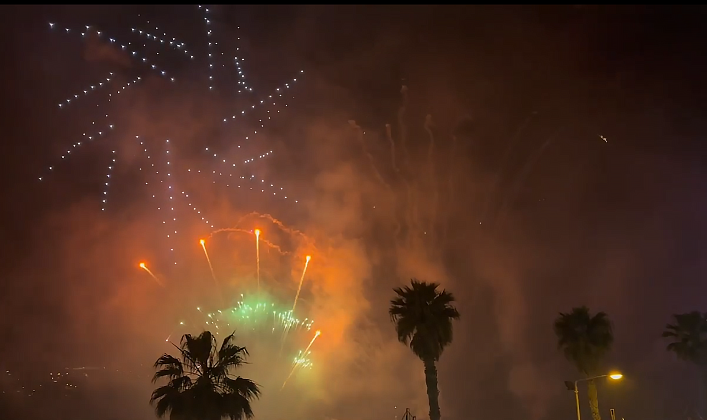

# Fireworks And Drone Shows

Although the technology behind them varies significantly, there are more similarities than differences in the execution of a fireworks show when compared to a drone show. Both mediums are designed and pre-visualized with computer software. Both mediums are run by a computer that manages timing and triggering. Setup consists of laying out hundreds of individual devices in very specific locations and, when ready, the show is executed with the press of a button.

Fireworks and drone shows each have a similar goal; wow an audience and fill the skies with lights and colors. They diverge greatly in how they accomplish this goal and both come with presentational advantages and disadvantages.

### The Big Picture

Anybody who has seen a drone light show and a fireworks show can pick out the differences pretty immediately. Drone shows create precise, complex shapes in the sky like a Lite-Brite. They can make a UFO materialize out of the darkness, create logos and text, or reproduce the face of a famous figure like Albert Einstein. Drone Shows make storytelling easy, by directly drawing whatever you want in from of the crowd's eyes. Fireworks are more kinetic. They create brighter, faster, and more explosive splashes of color in the sky. They evoke emotion and storytelling in a more abstract way, with colors, effects, and rhythm. The two mediums have incredible potential in their own ways, and a combination of the two pushes live entertainment to the next level.

### Design and Execution Complexity

Although it may seem counter-intuitive given how long they've been around, designing and executing a fireworks show is generally more complex than a drone show. There are countless combination of colors, shapes, and sizes of pyro products. Designing a fireworks show means needing a deep understanding of available effects and understanding how and when to use them. The end result is dozens of different types of products that must be placed in specific locations, must be wired to firing modules, and must be carefully organized so that the correct effect fires when commanded. A drone, by comparison, simply represents a single light in the sky. Every drone is the same, can be placed at any location in a launchpad, and returns to their exact location at the end of a show. Drones are essentially pixels that can be moved in any direction and set to any color tens of times per second. Designing a drone show is a matter of choosing positions and colors of the drones to create patterns and shapes in the sky. Verge Aero's [Design Studio](../drone-show-software/publish-your-docs/) makes this almost trivial and allows artists to focus on creating a story and iterating on incredible lighting effects.

### Stochasticity

As technology has improved, the repeatability of fireworks has gotten pretty good. Being able to get the same height on a shell, the same duration on an effect, and predictable timings are essential to choreographing a show to a soundtrack. Regardless of how close they get, the repeatable, accurate execution of pyro pales in comparison to drone light shows. Because each drone has its own suite of processors and sensors, drones are always within centimeters of where they're supposed to be and synchronized within milliseconds.&#x20;

### Noise

Drone Shows are pretty quiet. Even with hundreds of drones in the air at standard viewing range, the sound that they produce is more akin to the soft hum of a swarm of bees than the the loud bang of fireworks. Interestingly, this is an advantage or a disadvantage depending on who you ask. It doesn't freak out dogs and it doesn't annoy the neighbors, but there isn't a powerful gut punch that some people crave from pyro. The silence of drone shows allows music to take center stage, uninterrupted, but fireworks may also accentuate a show with a much needed "Boom" at a climax.

### Light

Drones have bright RGBW LEDs attached them that support fine-tuned intensity and color. It's a somewhat tired statistic, but each light is capable of displaying over 4 billion different colors (but who's counting and who can tell?). There are also many options for color when it comes to pyrotechnics, but they generally can't be used in a precise enough manner to draw images in the skies. One place where fireworks trump drone shows, however, is in the _intensity_ of the light. The burning chemical compounds and explosions of pyro effects are often many times brighter than a single drone. This is an aspect that takes much consideration when designing a show that combines both elements.

<figure><figcaption>
Drones in a formation over a fireworks burst below it
</figcaption></figure>

### Smoke

This probably goes without saying, but drones do not emit smoke. If they do, then there's something wrong. Pyro, on the other hand, has the potential to produce large amounts of smoke, a reality that is factored into show planning. The smoke produced by pyro actually provides an _excellent_ backdrop to drone light shows. The particulates in the air causes light to be bounced around and makes it appear to "bloom" in beautiful ways.

<figure><figcaption></figcaption></figure>

### Weather

#### Wind

Something both entertainment forms have in common are that they can be negatively impacted by wind. Drones use GPS technology to find their current position and will automatically resist wind if they are pushed away from their target. If the wind exceeds the thrust limits of the drones, however, then the show must be cancelled as they will be unable to move at the speeds necessary to avoid collisions. With pyro, if wind is blowing the wrong way and is too intense, then launched shells can be carried too far off course and cause the fallout zone to stretch into the viewing audience. Alternatively, stagnant air can cause smoke to sit in the sky and obscure upcoming fireworks.

#### Rain

Rain can wreak havoc on a fireworks show. Getting pyro product wet can cause them to fail to trigger entirely. Any amount of rain means the cancellation of a fireworks show. If rain gets into a drone's circuitry, it can also cause issues. However, some drones, such as the X1 and X7, are water resistant and launch and fly successfully during a light rain. Water has a subtle impact on GPS, but not enough to cause issues and exposed wires such as those inside of a drone's motors are coated and will not fail when wet.

### Pyro On Drones

Drones offer a unique opportunity for pyrotechnic effects. While previously products either needed to be mounted to scaffolding or launched into the air with mortars, drones can now serve as a vehicle to get a product into any position in the air with an incredible level of precision.&#x20;

Any drone with sufficient payload capacity can serve as a pyro drone. Our [X1 ](../drone-show-hardware/drones/x1.md)platform is capable of carrying a significant number of products at once. It is common to use an existing wireless pyro module from a firing system company such as [Cobra](https://www.cobrafiringsystems.com/) or [Fire One](https://www.fireone.com/). These modules can be bulky and heavy, and mounting them introduces a penalty to flight time. They are built with their own set of power sources, radios, and processors. Additionally, they must be used with a completely independent ground station setup and software.

Issue - Reliability

Wireless firing systems rely on persistent data pulses for time synchronization and for arming. This can be a concern in environments where there is radio interference or lots of wireless traffic (such as in a city). Triggering may be patchy or sparse and can have a negative impact on the quality of the drone show.

#### Issue - Safety

A major issue with using a 3rd-party pyro system is that they lack context. Wireless firing systems were not built with the expectation that they would be strapped to a drone. Take, for example, a situation where a drone does launch due to some sensor failure. Although the firing systems are capable of disarming an individual module remotely, it is nearly impossible to identify _which_ module is attached to any single drone. If it's not disarmed, then it will fire and potentially damage the launchpad. In a worst-case, a drone show operator can travel into a cleared launchpad and manually disengage the pyro module, but this puts the operator in unnecessary danger. Even worse, the same issue occurs when a drone needs to enter a failsafe during a show, except the exact location where it will land is not known and the operator will most certainly need to walk _underneath_ other drones flying around with explosive materials.

#### Issue - Complexity

As previously mentioned, every drone in a drone light show is interchangable. They are each capable of performing the same job and can thus be swapped out arbitrarily. When pyro is introduced, simplicity goes out the window. Now, specific drones must be fitted with specific product and _also_ are matched to specific firing system modules that are all timed by an external system. If a drone is placed into an incorrect role within the show, then a pyro effect may fire in a completely incorrect location within a shape or in the wrong order. Two separate systems also means having separate teams managing drones and pyro. The added complexities increases the burden on operators and leads to human error.

### The Verge Pyro Module

Verge Aero has addressed many of the downsides of executing pyro with 3rd-party modules by creating its own, tightly integrated drone firing system. The [NFPA ](https://www.nfpa.org/)compliant module connects directly with the [X1](../drone-show-hardware/drones/x1.md) drone cardbus system and exposes up to 6 firing cues.

#### Solution - Reliability

Because the triggers are made by the onboard processor, there are no concerns about range limitations or spectrum interference. A secondary radio system is unneccessary and, as long as the pyro is rigged properly, it will fire reliably.

#### Solution - Safety

With a module that can communicate directly with the onboard computer, the drone now has full control over the arm state. If a drone fails to launch or it enters a failsafe state, it can _automatically_ disable the pyro module and ensure it does not fire in an undesirable situation. Full control of the pyro modules are also provided to the pilot standing at the command center.

#### Solution - Complexity

Every cue has a continuity check that validates that an e-match is connected. The [Console ](../drone-show-software/verge-console/)receives data about which cues are populated and compares those against an expected manifest. Assigning a drone a role in the show can be automatically checked to make sure that it   is at least populated with the pyro channels that are expected. Any two drones that contain the same products are now interchangable. Even if they are swapped, the drone roles will be auto-assigned by the console and their trigger times will adjust appropriately.

### Our Design Tools

Designing shows, whether using a pyro module or not, is greatly simplified by using the Verge [Design Studio](../drone-show-software/publish-your-docs/).

#### Synchronizing Drone Show and Pyro

Designing a drone show choreography alongside pyro can be challenging because each medium is designed with different software. The Design Studio allows videos to be imported and overlayed inside of the 3D scene. Video renders can be exported from a fireworks design software such as Finale3D. This means that scrubbing the timeline will display both the pyro effects and drone effects in one space.

<figure><figcaption></figcaption></figure>

#### The VVIZ Format

VVIZ stands for \[V]erge \[Vi]suali\[z]ation Format. This format has been adopted by multiple software vendors as an interchange format for drone shows. Finale3D's documentation on the format can be found [here](https://finale3d.com/documentation/vviz-file-format/). The format has support for exporting drone position, colors, and pyro payloads.

#### Exporting to Finale3D

[Finale3D](https://finale3d.com/) is a very powerful fireworks design software that is used by industry professionals across the world. The Design Studio allows any created show to be exported to the VVIZ file format which is consumable by Finale3D.

VDL Support

Finale3D's VDL (Visual Descriptive Language) can be used to define pyro drone payloads. It is used to indicate what product is attached, what color it is, how long it burns, how bright it is and more. This data is exported as part of the VVIZ format and can be visualized directly within Finale3D as part of their other pyro previz.

#### Trigger Control

When using the Verge Pyro Module, all triggering is planned as part of the same design process. Trigger commands can be placed in the Design Studio timeline with precise timing and automated sequencing. Complex trigger sequences become simple. A single timeline event can, for example, create triggers that chase through a shape in order from left to right.

#### Yaw Control

Along with position, the design studio allows drones to be turned to face a specific direction. This can be changed dynamically throughout the show depending on the shape that the drones are traveling on. The simplest example of this, along with trigger control, can be seen below, with a circle that fires comets outward by yawing the drones and firing them in order of the circle.

<figure><figcaption>
Red comets being fired outward around a circle with a sequential trigger
</figcaption></figure>

#### Previz

The Design Studio is capable of showing realistic previews of pyro drones at any point in the design process. The visualization accounts for the drone's movement, the way the pyro is mounted, and what effect is being triggered.

<figure><figcaption>
A waterfall effect visualized in the design studio
</figcaption></figure>
