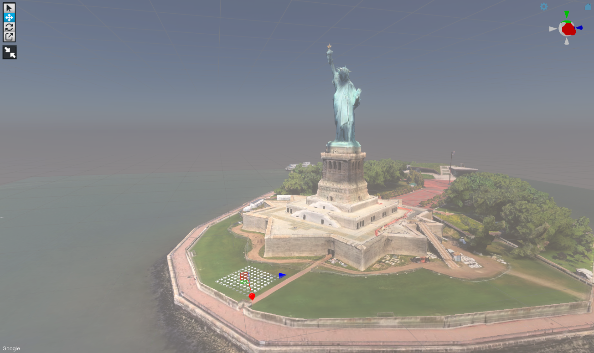
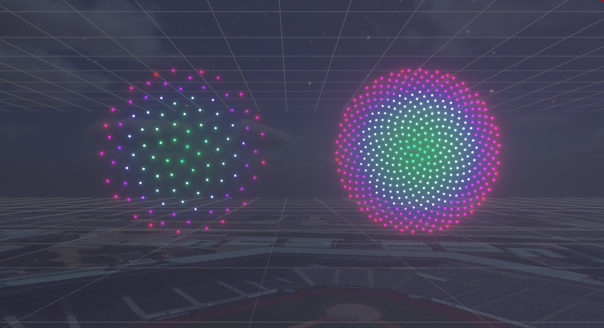
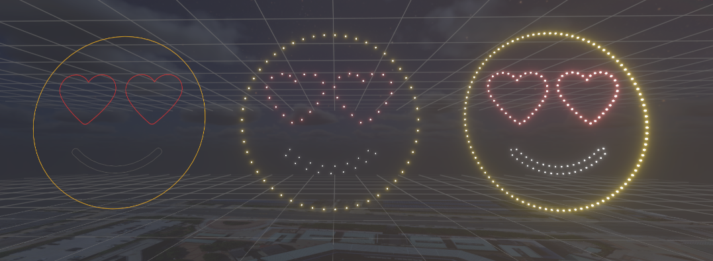
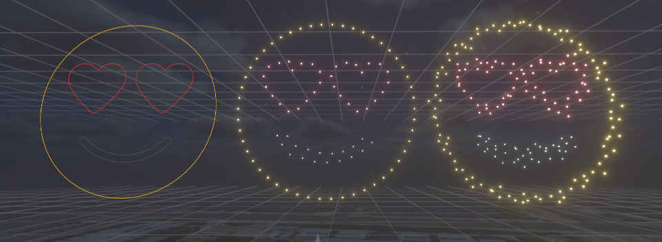
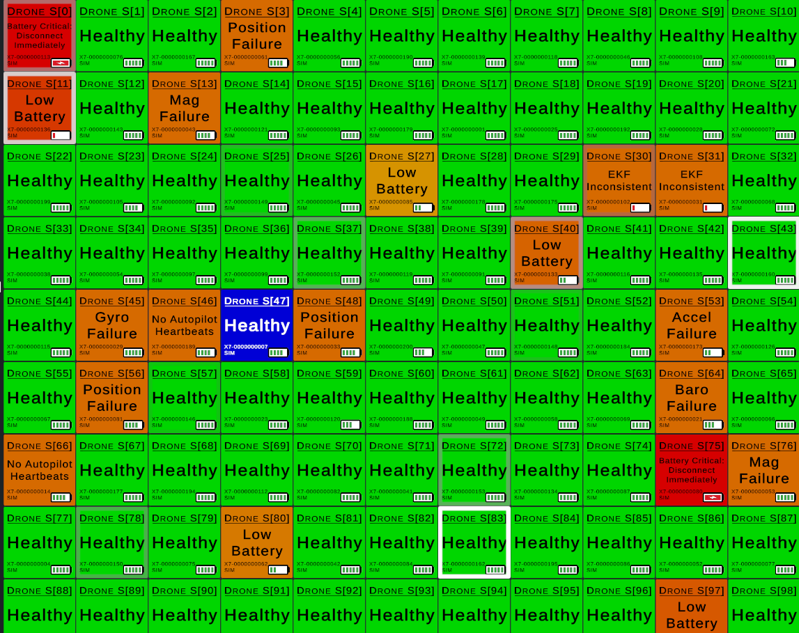

# How Drone Shows Work - An Overview

At first glance, drone shows can appear impossibly complex and difficult to comprehend. But, like most things, they become quite simple when broken down.

First and foremost, drone shows are not flown manually. Each drone is responsible for automatically executing its own role within a show. There is still a pilot involved, but their job is to make sure that everything is configured properly and to make fleet-wide commands such as to start the show, or land/cancel it. Computers execute a show and a pilot commands it.

### 1 vs 100

A drone show consist of hundreds or even thousands of drones, but the number drones, surprisingly, isn't all that relevant. In a well-choreographed dance, each dancer has a very specific set of steps or movements that they must follow to create a synchronized performance. With practice, each dancer doesn't even need to be aware of what the others are doing to be exactly where they need to be exactly when they need to be there. Marching bands are a perfect example of this, creating intricate patterns and shapes when viewed from above; each band member shifting around a field without colliding with another. You can view a drone like a dancer. If it is able to be in a specific place at a specific time, then the locations of all other drones is irrelevant. This is an important distinction and the main reason that, from a technology perspective, _drone count doesn't matter_.

For a given drone show, a single drone will be given a set of instructions that will tell it to move through space in a way that will not cause collisions with any other drone and will move it into complex formations. A separate set of instructions tell the LED light to show a different color 30 times every second. It's like playing a movie that only has a single pixel.

The main challenges, then, are positional accuracy and timing.

### How Are They So Accurate?

#### Space

Drones are chock-full of gadgets and gizmos that give it information about how it is oriented, how it is moving, and where it is at. Accelerometers are able to read acceleration, or how the drone is speeding up or slowing down. Accelerometers also read Earth's gravitational force and can tell the drone where "down" is. Gyroscopes read angular velocity, or how quickly a drone is rotating. Magnetometers read Earth's magnetic field and generate a heading in a very similar fashion to a compass. All of these sensors can be read at hundreds of times every second and give an excellent estimate of small changes in movement. They are also what are used to keep the drone "balanced", driving motors to speed up or slow down to keep the drone upright.&#x20;

With subtle movements accounted for, the missing piece is position. The tech behind giving outdoor drones such precise positioning is ubiquitious and can be found in every modern smart phone. [GNSS](gps-gnss/), or more commonly known as GPS, is a satellite-based positioning system that can provide an accurate 3D position anywhere on the surface of the Earth given a clear view of the sky. But GPS, on its own, is not accurate enough to provide the tight formations that are seen in drone light shows. [RTK ](gps-gnss/rtk-gps.md)(Real-Time Kinematics) technology is able to bridge this gap. A fixed base station on the ground receives GNSS data and generates corrections to boost the accuracy of the drones positions from multiple meters to just a couple centimeters.

#### Time

Luckily, GPS also provides a secondary data point, time. Time is an essential component for solving position from GPS signals and is provided with an astounding accuracy of around 100 billionths of a second. So, when a drone show is triggered to start, it is scheduled relative to a time in the future. That way, with a highly-accurate clock on each drone, they can all start at almost exactly the same time.&#x20;

The drone is constantly attempting to hit a moving target: the location where the flight plan tells it to be at a specific point in time. Because the drone knows where it is via GPS and it knows where it needs to be, it can automatically speed up or slow down to get to its target. If it overshoots, then it will immediately reverse direction. This is why wind (assuming it does not exceed the physical limitations of the drone) does not knock drones out of position.

## Design Studio - The Master Choreographer

Now that we understand how a single drone can play back a show plan, how do we even generate all of them to begin with? Enter Verge Aero's [Design Studio](../drone-show-software/publish-your-docs/). Designing a drone show using our software does not require writing a single line of code. In fact, most drone show designers come from an animation or art background. Drone show design is a deep topic on its own, so we'll keep the details to a minimum and focus on the main topics.

### Where in the World?

Unlike other 3D design applications, Verge Aero's Design Studio is intended for designing flight patterns in real-world locations. Every portion of the design process is heavily dependent on environmental factors and, in the case of tight integrations with landmarks such as monuments or skyscrapers, operating without visual references is incredibly difficult.  The studio is capable of pulling in maps or scale-accurate 3D Google tiles by simply typing in the GPS coordinates of the show venue. Are we flying high enough to avoid obstructions? Can the audience see the show properly? These questions no longer need to be answered when a 1:1 scale version of the environment is instantly available to the designer.&#x20;

<figure><figcaption>
A 1:1 scale representation of the Statue of Liberty
</figcaption></figure>

### Laying Out A Launchpad

After choosing reference GPS coordinates, the first step in designing a drone show is choosing a drone count and a launchpad. There are multiple shapes to choose from, but most often it takes the shape of a grid with equal distancing between drones. This will serve as the starting point of the show and will also be referenced when the pilot and other operators set up the for the show in the real world. If the launchpad changes or the drone count changes half way through the design, fret not! The launchpad can be adjusted at any time and the show will accomodate any changes dynamically. As can be seen below, moving the launchpad in the editor adjusts flight paths automatically. Of course, in the real world the launchpad won't be moving.

<figure><figcaption>
Adjusting the launchpad results in immediate, realtime adjustments. 
</figcaption></figure>

### Launching and Landing

Launch and land sequences are entirely automated. They're each represented as a single event on a launchpad's timeline. The events will scale in time automatically based on preset parameters, how many drones are in the launchpad, and how densely packed the drones are.&#x20;

<figure><figcaption>
With a default launch sequence and a single shape target, the design studio automatically generates flight paths to get them off the ground
</figcaption></figure>

### Shapes - Designing Drone Formations

The [Design Studio](../drone-show-software/publish-your-docs/) allows a designer to import a large number of formats to extract drone formations from. These formats include SVG files, 3D models, images, and more. Rather than individually placing the position of drones, various algorithms can take shapes and automatically place drones to evenly distribute them across the shape. A very simple example can be seen below with a "Fill Circle" primitive. One circle has been allocated 100 drones and the other has been allocated 500. Without needing to create two separate shapes, the software automatically distributes drones on the shape to support the desired number of drones. It can even automatically make the shapes smaller or larger to make sure that the drones are not too close together.

<figure><figcaption>
Two versions of a circle formation. The left contains 100 drones and the right contains 500
</figcaption></figure>

Below is an imported SVG of an emoji with heart eyes. Without modifying the shape in any way, the software automatically calculates weighting for each set of lines so that drones can be distributed with a constant pixel density. Also, note that the drones are automatically placed to ensure that the definition of the shape is retained. The hearts in both formations placed a drone at the inflection point in the "dip" at its top.

<figure><figcaption>
The imported SVG of a heart eyes emoji on the left, 100 drones allocated to the emoji in the middle, and 200 drones allocated to the emoji on the right.
</figcaption></figure>

Formations can be far more complex, with dynamic animations, 3D effects, lighting effects, and much more. Drones can also be split up into groups and execute formations independently. To explore this topic more, feel free to explore the many other topics in the [Design Studio](../drone-show-software/publish-your-docs/) section of our documentation.

### Transitions

Figuring out how to get drones from one shape to another can be tricky endeavor. Luckily, the Design Studio has this handled as well. When choosing to morph/transition between two shapes, the Design Studio will automatically choose locations while minimizing the total traveled distance across the entire swarm. It will also ensure that paths do not intersect when doing so. In the example below, 100 drones are about to transition from a cube to a sphere. Flight paths are represented by white lines and show optimally-matched transitions.

<figure><figcaption>
Shows transition paths from a cube (blue) to a sphere (red)
</figcaption></figure>

### Creating A Flyable Show

After a show is designed, it must be simulated to generate flyable paths. The design studio runs a sophisticated simulation that flies a swarm through the commanded events; it launches the drones,  flies to the formations, transitions between formations, and then returns to home. Over the course of the simulation, it enforces physical limitations on each drone; the simulation limits flight speed, the rate at which each drone can speed up or slow down, and makes sure that drones keep a safe distance apart at all times. If a show is designed that violates any of these rules, then it will not simply fail out and stop. Instead, it will attempt the match the commanded shapes and movements as closely as possible. Every show design will result in a show that is flyable, but it may not match the artist's vision. The example below shows an example of what happens when too many drones are forced into a space that doesn't keep them a safe distance apart. The drones attempt to meet the commanded shape, but will be pushed away to maintain safety. It would then be a simple matter to resize the shape, reduce the number of drones in the shape, or use an automatic tool to resize the shape based on drone count. The key takeaway is that you _**cannot**_ design a show using Verge Aero's software that results in an unsafe flight.

<figure><figcaption>
The right shape displays drone behavior when too many drones are placed in a small space. The software keeps drones apart so that they do not collide while representing the shape as closely as possible.
</figcaption></figure>

## The Command Center

Once a show is designed, then the focus turns to performing a drone show. Besides the drones themselves, all that's needed for configuring a drone show is a laptop and some custom base station hardware. Verge Aero's base station consists of two [radios](../drone-show-hardware/networking/), an [RTK](gps-gnss/rtk-gps.md) base, and a battery backup. Rather than using an off-the-shelf solution, such as wi-fi (802.11), the Verge system uses a custom solution that supports thousands of drones over a single antenna. The laptop runs an application called the [Verge Console](../drone-show-software/verge-console/) that is responsible for managing, configuring, and executing the drone show.

<figure><figcaption>
A shot showing a view that the pilot may see when setting up for a show
</figcaption></figure>

#### Uploading the Show

All of the drones that will be used in the show are laid out in rows and turned on. They automatically connect to the base station and appear in the [Verge Console](../drone-show-software/verge-console/) as a device node. Once all drones are verified to be connected, the _entire_ show is uploaded to every drone. Every set of commands, lighting sequences, and flight plans are uploaded at once. This means that any drone that is in the field can take up any role in the show.

#### "Slotting" the Drones

The launchpad that was created as part of the design process is now used as a reference to lay out the drones. The drones must be placed in very close proximity to each spot that was defined in the launchpad. The current position of each drone and a line connecting it to its nearest "slot" can be seen from the console's 3D view. We use the term "slot" to describe a role in a show. The roles are labeled with numbers starting at 0 and counting upward. The slot will turn green to signal that a drone has been bound to it. If the launchpad's altitude doesn't match the altitude of the drones (due to a raised platform, for example), the performance will automatically be shifted to accomodate.

<figure><figcaption>
Drone being turned on and then being assigned roles in the launchpad
</figcaption></figure>

### Verifying Health

There are many different tools and indicators that show battery percentages, sensor health, and much more. At a glance, the pilot can tell if drones are ready to go based on color. Green means good, and any shade of orange, red, or blue indicates some other issue. The example below has been simulated. It is not common to see this many issues at once! The pilot can either swap bad drones out or they can take steps to address the issues such as swapping batteries or recalibrating sensors.

<figure><figcaption>
An example of some of the many different health errors that can manifest
</figcaption></figure>

### Launching the Show

If all drones are green, show no issues, and have sufficient battery, the show is ready to go! The pilot hits the go button, and the drones execute their show plans. The end result is pure magic.

<figure><figcaption>
A show performed by Verge Aero during Chinese New Year
</figcaption></figure>
